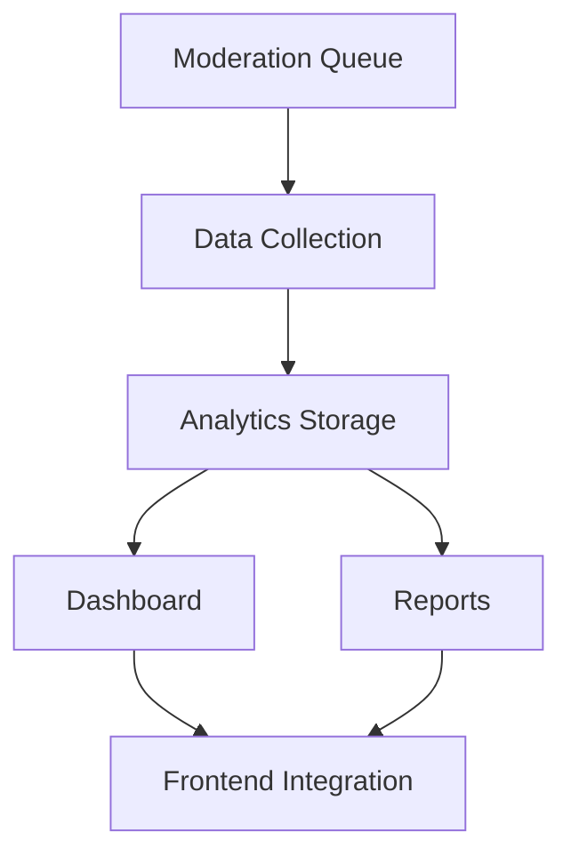
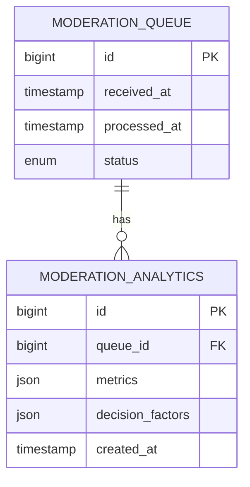

# Moderation Analytics System Plan

## Overview


## 1. Database Schema


## 2. Data Collection Points
- Queue entry (received_at)
- Each workflow transition
- Final decision (approved/rejected)
- Time spent in each state
- Moderator notes and flags

## 3. Dashboard Visualizations
- Queue health metrics
- Decision distribution
- Moderator throughput
- SLA compliance

## 4. Reporting Requirements
- Daily/weekly summaries
- Moderator performance
- Content quality trends
- Automated alerts

## 5. API Endpoints
```
GET /moderation/analytics/summary
GET /moderation/analytics/queue-metrics
GET /moderation/analytics/moderator-performance
POST /moderation/analytics/reports/generate
```

## 6. Implementation Roadmap
1. Schema updates (Week 1)
2. Data collection (Week 2)
3. Dashboard UI (Week 3)
4. Reporting API (Week 4)
5. Integration testing (Week 5)