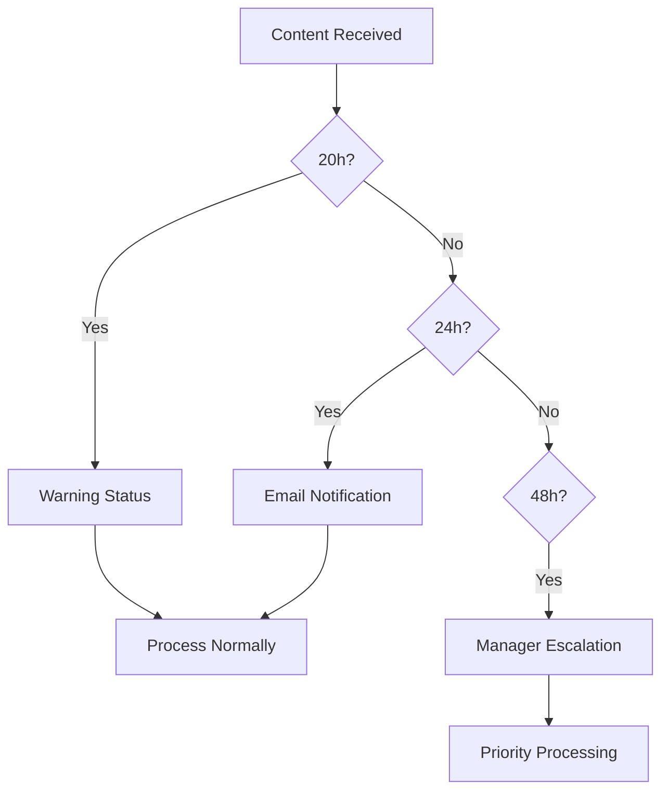
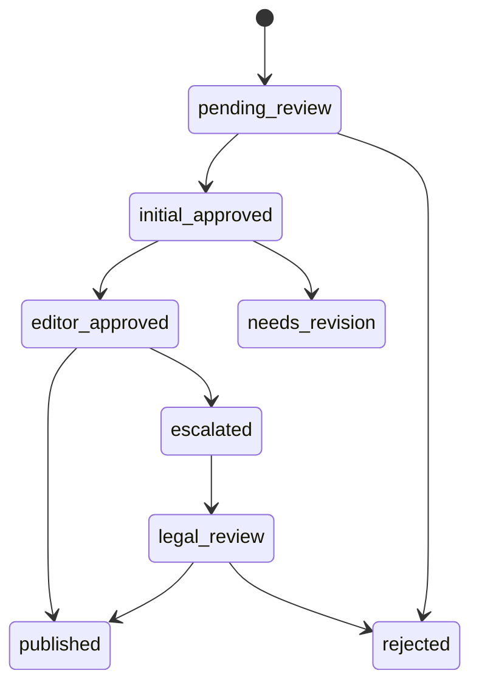

# Moderation Queue Workflows

## Priority Scoring System

Items in the moderation queue are assigned a priority score (0-100) based on:

- **Content type** (higher priority for user-generated content)
- **Report severity** (higher priority for serious violations)
- **Author reputation** (lower priority for trusted authors)
- **Content age** (higher priority for newer content)

Default priority: 50  
High priority: 75+  
Critical priority: 90+

## Standardized Status Values

| Status | Description | Required Reviewers |
|--------|-------------|--------------------|
| pending_review | Initial state | - |
| initial_approved | First-level approval | 1+ reviewers |
| editor_approved | Editorial approval | Senior editor |
| published | Final published state | - |
| rejected | Rejected content | - |

## Batch Processing

Moderators can create batches of items to process together:

1. Create batch with filter criteria or manual selection
2. System assigns priority scores to all items
3. Items are sorted by priority within batch
4. Moderators process items in order
5. Batch status updates as items are processed

Batch statuses:
- `pending` - Not started
- `in_progress` - Some items processed
- `completed` - All items processed
- `archived` - Batch closed

## Polymorphic Workflow Assignment
Workflows can be assigned to multiple content types:

```php
// Example polymorphic relationship
$workflow->assignable()->associate($content);
$workflow->save();
```

Supported assignable types:
- Content
- Media
- Comments
- User profiles

## Moderator Notes

Each queue item can have multiple notes:
- **Public notes**: Visible to all moderators
- **Private notes**: Only visible to note author
- **System notes**: Auto-generated by triage rules

Notes support markdown formatting and can include:
- Context about the content
- Reasoning for decisions
- Follow-up actions needed

## Automated Triage Rules

Basic triage rules run when items enter queue:

1. Check for banned words/phrases (+10 priority)
2. Check author reputation (-5 to +20 priority)
3. Check content type (sets base priority)
4. Check report history (+5 per prior report)
5. Apply content-type specific rules

Rules can be extended in `config/content_moderation.php`

## Performance Considerations

System enforces these performance limits:
- Transition processing: ≤0.5s
- History cleanup: ≤1.0s 
- Concurrent locks: 5s timeout

Critical sections use optimistic locking:
```php
DB::transaction(function () {
    $content = Content::lockForUpdate()->find($id);
    // Process workflow transition
});
```

## SLA Tracking & Escalation



### SLA Thresholds
| Threshold | Action |
|-----------|--------|
| 20h | Set warning status |
| 24h | Send overdue notification |
| 48h | Escalate to manager |

### Metrics Reporting
```php
// Get SLA compliance stats
ModerationQueue::selectRaw('
    COUNT(*) as total,
    SUM(CASE WHEN processed_at IS NULL AND received_at < NOW() - INTERVAL 24 HOUR THEN 1 ELSE 0 END) as overdue,
    SUM(CASE WHEN processed_at IS NOT NULL AND processed_at <= received_at + INTERVAL 24 HOUR THEN 1 ELSE 0 END) as on_time
')->first();
```

## Enhanced Status Values

### New Statuses
- `needs_revision` - Requires author changes
- `escalated` - Needs senior review
- `scheduled_publish` - Approved for future publish
- `pending_legal_review` - Needs legal team input

### Status Transitions


## Configurable Thresholds
Set in `config/performance.php`:
```php
'moderation' => [
    'max_processing_time' => 0.5, // seconds
    'max_queue_size' => 1000,
    'lock_timeout' => 5, // seconds
    'batch_size' => 50,
    'priority_weights' => [
        'content_type' => 0.3,
        'severity' => 0.4,
        'author' => 0.2,
        'age' => 0.1
    ]
]
```

## Database Locking
- Row-level locking for workflow transitions
- Table-level locking for batch operations
- Deadlock detection with automatic retry
- Lock wait timeout: 5s (configurable)

## Audit Logging
- `/api/moderation/audit` - Get moderation logs
- Logs include:
  - Status transitions
  - Moderator actions
  - System events
  - Performance metrics
  - Lock wait times
- Retention: 90 days (configurable)

## Performance Metrics
| Metric | Target | Measurement |
|--------|--------|-------------|
| Processing Time | ≤0.5s | 95th percentile |
| SLA Compliance | ≥95% | 24h threshold |
| Escalation Rate | ≤5% | Of total items |