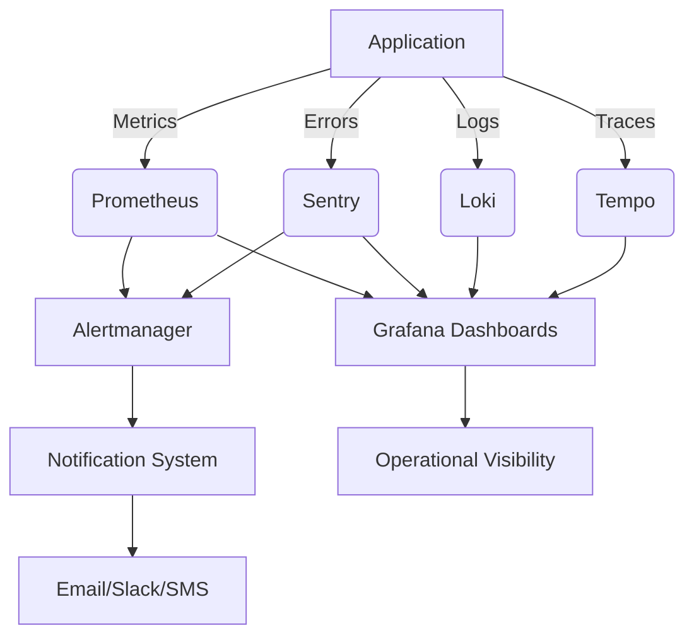

# Comprehensive Monitoring System Implementation

## Architecture Overview


## 1. Application Performance Monitoring
### Metrics Collection
- API response times (p95, p99)
- Queue processing times
- Database query performance
- Redis cache hit rate
- Memory usage per service

### Configuration
```yaml
# Example Prometheus scrape config
scrape_configs:
  - job_name: 'api'
    metrics_path: '/metrics'
    static_configs:
      - targets: ['api:8000']
  - job_name: 'queue'
    metrics_path: '/metrics'
    static_configs:
      - targets: ['queue:8001']
```

## 2. Error Tracking & Alerting
### Sentry Configuration
- Track all unhandled exceptions
- Performance monitoring
- Frontend error tracking
- Release tracking

### Alert Rules
```yaml
groups:
- name: api-alerts
  rules:
  - alert: HighErrorRate
    expr: rate(http_requests_total{status=~"5.."}[5m]) > 0.1
    for: 10m
    labels:
      severity: critical
    annotations:
      summary: "High error rate on {{ $labels.instance }}"
      description: "Error rate is {{ $value }}"
```

## 3. SLA Compliance Monitoring
### Defined SLAs
| Component       | Metric               | Target       |
|-----------------|----------------------|--------------|
| API             | Availability         | 99.9%        |
| API             | Response Time (p95)  | < 500ms      |
| Queue           | Backlog              | < 100        |
| Database        | Query Time (p99)     | < 1s         |

### Recording Rules
```yaml
- record: api:availability
  expr: avg_over_time(up{job="api"}[1h])
- record: api:response_time_p95
  expr: histogram_quantile(0.95, rate(http_request_duration_seconds_bucket[5m]))
```

## 4. Notification Integration
### Alertmanager Configuration
```yaml
routes:
  - receiver: 'critical'
    match:
      severity: 'critical'
  - receiver: 'warning'
    match:
      severity: 'warning'

receivers:
  - name: 'critical'
    email_configs:
    - to: 'oncall@example.com'
    slack_configs:
    - channel: '#alerts-critical'
  - name: 'warning'
    email_configs:
    - to: 'dev-team@example.com'
```

## 5. Operational Dashboards
### Dashboard Requirements
- System Health Overview
- Performance Metrics
- Error Rates
- SLA Compliance
- Resource Utilization

### Example Grafana Dashboard
```json
{
  "title": "API Monitoring",
  "panels": [
    {
      "title": "Response Times",
      "type": "graph",
      "targets": [
        {
          "expr": "histogram_quantile(0.95, rate(http_request_duration_seconds_bucket[5m]))"
        }
      ]
    }
  ]
}
```

## Implementation Timeline
1. Week 1: Setup metrics collection and dashboards
2. Week 2: Configure error tracking and alerting
3. Week 3: Implement SLA monitoring
4. Week 4: Finalize notification integration