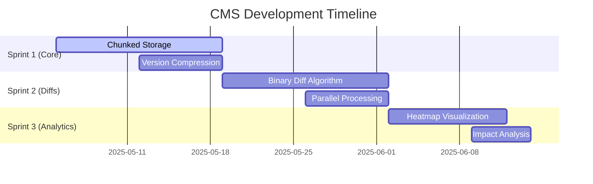

# CMS Next Phase Development Roadmap

## Content Versioning System Optimizations
1. **Chunked Storage Implementation**
   - Store content versions in 10,000 character chunks
   - Add chunk metadata tracking
   - Implement progressive loading API endpoints

2. **Version Compression**
   - Apply zstd compression to version chunks
   - Maintain uncompressed working copies
   - Add compression level configuration

3. **Version Pruning**
   - Automatic pruning based on:
     - Age (default: 90 days)
     - Number of versions (default: 100 per content)
   - Configurable retention policies

## Diff Processing Improvements
1. **Binary Diff Algorithm**
   - Implement binary delta algorithm
   - Reduce storage requirements by 60-80%
   - Maintain compatibility with text diffs

2. **Parallel Processing**
   - Process chunks concurrently (3 parallel max)
   - Implement work queue system
   - Add progress tracking

3. **Visual Diff Enhancements**
   - Semantic highlighting
   - Side-by-side comparison
   - Interactive navigation

## Analytics Enhancement Roadmap
1. **Version Heatmaps**
   - Visualize edit frequency
   - Show content change patterns
   - Identify collaboration hotspots

2. **Edit Frequency Tracking**
   - Per content type metrics
   - User edit patterns
   - Time-based analysis

3. **Impact Analysis**
   - Restoration impact predictions
   - Dependency mapping
   - Change propagation modeling

## Implementation Timeline

## Risk Mitigation
1. Maintain legacy endpoints during transition
2. Feature flag all new functionality
3. Comprehensive rollback procedures
4. Performance monitoring baseline