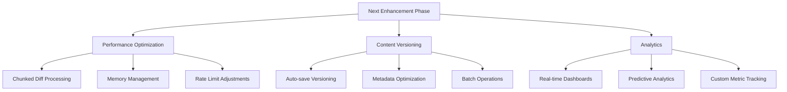

# CMS Next Phase Enhancement Plan

## Overview
This document outlines the planned enhancements for the CMS system focusing on three key areas:
1. Performance optimization
2. Content versioning improvements  
3. Analytics enhancements

## Implementation Roadmap

### Sprint 1 (Weeks 1-3)
**Performance Focus:**
- Implement chunked diff API endpoints
- Add progressive loading for frontend
- Benchmark against current performance metrics

**Versioning Improvements:**
- Develop intelligent auto-save throttling
- Implement version grouping by editor session

### Sprint 2 (Weeks 4-6)  
**Memory Optimization:**
- Add automatic chunk garbage collection
- Implement compression for stored versions
- Develop memory monitoring middleware

**Analytics:**
- WebSocket-based dashboard updates
- Configurable refresh intervals
- Anomaly detection alerts

### Sprint 3 (Weeks 7-9)
**Advanced Features:**
- Dynamic rate limiting system
- Bulk version operations
- Predictive analytics models

## Key Performance Targets
| Metric                  | Current | Target  |
|-------------------------|---------|---------|
| Comparisons/sec         | 30      | 50      |
| Memory per operation    | 1.2GB   | <500MB  |
| Dashboard update latency| 1.2s    | <500ms  |
| Version load time (100) | 4s      | <2s     |

## Risk Mitigation
1. Chunk processing complexity - phased rollout plan
2. Memory optimization - benchmark after each change
3. Real-time analytics - fallback to polling if WebSocket issues