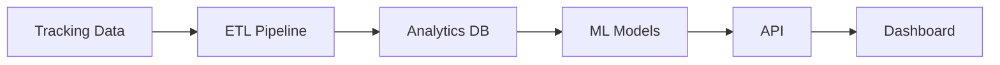
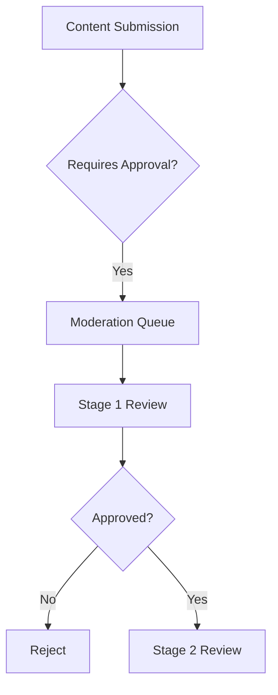
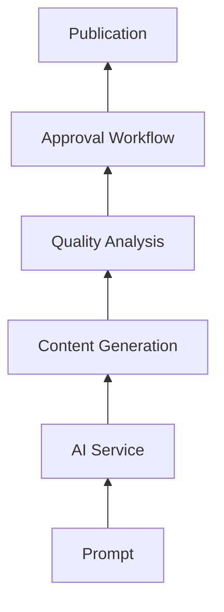

# CMS Next Phase Development Roadmap

## 1. Content Analytics Implementation (Priority: High)

### Current State
- Basic view tracking (time spent, scroll depth)
- Version comparison capabilities
- Export functionality

### Proposed Enhancements
- **Predictive Analytics**:
  - Machine learning models to predict content performance
  - Integration with existing tracking fields
  - API endpoint: `/api/analytics/predictions`

- **Enhanced Dashboards**:
  - Real-time content performance metrics
  - Cohort analysis by user segments
  - Customizable widgets

- **Version Comparison**:
  - Visual diff heatmaps
  - Performance impact analysis
  - Automated recommendations

### Technical Requirements

## 2. Approval Workflow Enhancements (Priority: High)

### Current State
- Basic moderation queue
- Status tracking
- AI metadata storage

### Proposed Enhancements
- **Multi-stage Workflows**:
  - Configurable approval stages
  - Parallel approval paths
  - Conditional transitions

- **Role-based Approvals**:
  - Integration with existing RBAC
  - Approval thresholds
  - Escalation paths

- **SLA Tracking**:
  - Time-to-approval metrics
  - Bottleneck identification
  - Automated reminders

### Technical Requirements

## 3. AI Content Generation Integration (Priority: Medium)

### Current State
- Basic generation component
- Usage tracking
- Moderation integration

### Proposed Enhancements
- **Template-based Generation**:
  - Pre-defined content structures
  - Style guides integration
  - Multi-format output

- **Consistency Features**:
  - Brand voice maintenance
  - Tone analysis
  - Style scoring

- **Quality Control**:
  - Plagiarism checking
  - Readability scoring
  - SEO optimization

### Technical Requirements

## Implementation Timeline

| Feature Area | Phase 1 (2w) | Phase 2 (4w) | Phase 3 (2w) |
|-------------|-------------|-------------|-------------|
| Analytics | Core Models | Dashboards | Optimization |
| Workflows | Stage Engine | RBAC Integration | SLA Tracking |
| AI Generation | Templates | Consistency | Quality |

## Dependencies
1. Analytics depends on existing tracking tables
2. Workflows depend on moderation_queue schema
3. AI features depend on content versioning system