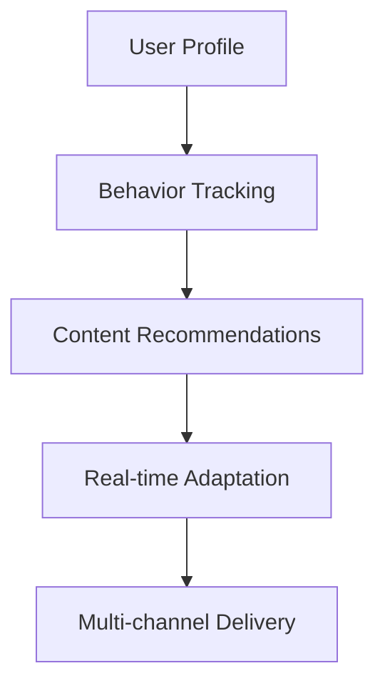
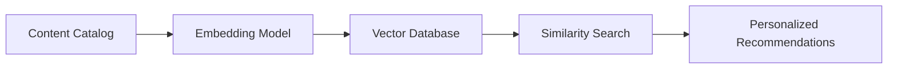
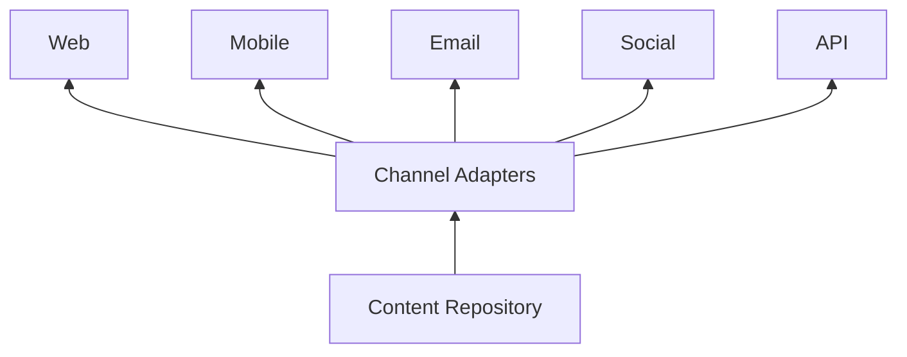
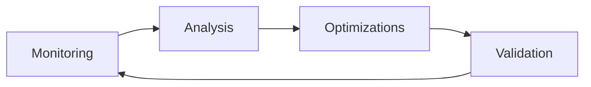
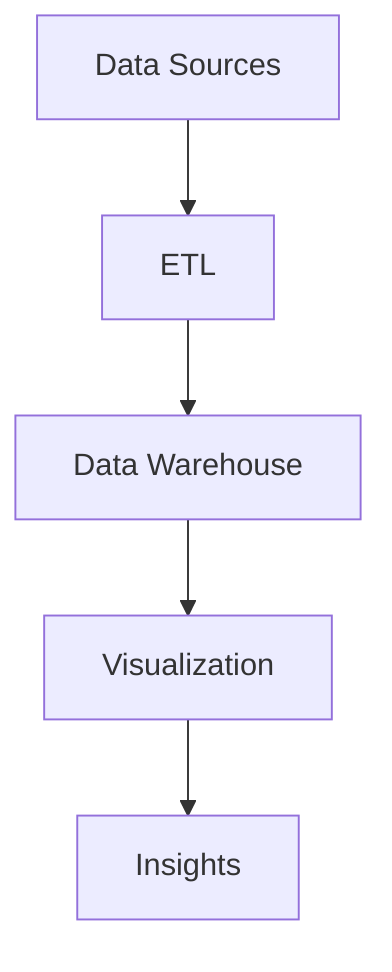

# CMS Next Phase Development Plan v2

## 1. Content Personalization Engine

- Implement user segmentation based on:
  - Content engagement history
  - Demographic data
  - Behavioral patterns
- Develop recommendation algorithms:
  - Collaborative filtering
  - Content-based filtering
  - Hybrid approaches
- Integrate with existing analytics infrastructure

## 2. AI-powered Content Recommendations

- Implement semantic search capabilities
- Develop content embedding pipeline
- Create A/B testing framework for recommendations
- Build feedback loop for continuous improvement

## 3. Multi-channel Content Distribution

- Develop channel-specific transformers
- Implement content adaptation rules
- Build scheduling system
- Create unified analytics across channels

## 4. Performance Optimization Framework

- Implement real-time monitoring
- Develop automated optimization suggestions
- Create performance benchmarks
- Build A/B testing for optimizations

## 5. Enhanced Analytics Dashboard

- Expand metric tracking
- Develop custom report builder
- Implement predictive analytics
- Add GDPR compliance reporting

## Implementation Roadmap

| Phase | Duration | Focus Areas |
|-------|----------|-------------|
| 1     | 3 weeks  | Core personalization engine, Basic recommendations |
| 2     | 4 weeks  | Multi-channel distribution, Enhanced analytics |
| 3     | 2 weeks  | Performance framework, GDPR integration |
| 4     | 3 weeks  | Refinement, Testing, Documentation |