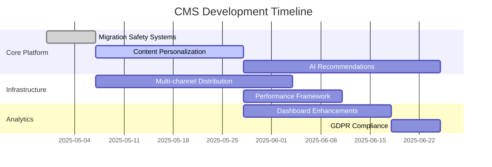
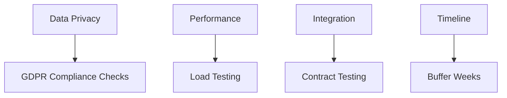

# CMS Next Phase Development Plan v3

## Implementation Roadmap

## Resource Allocation
| Team           | FTEs | Focus Areas |
|----------------|------|-------------|
| Backend        | 3    | Personalization, APIs | 
| Frontend       | 2    | Dashboards, UI |
| Data Science   | 2    | Recommendations |
| DevOps         | 1    | Infrastructure |

## Risk Assessment & Mitigation

## Stakeholder Engagement
- Monthly review sessions
- Automated progress reports
- Feedback integration workflows

## Feedback Mechanisms
- Automated A/B test reporting
- User behavior telemetry
- Weekly stakeholder surveys
- Production monitoring alerts

## Milestones & Deliverables
| Phase | Deliverables | Success Metrics |
|-------|-------------|-----------------|
| 1 | Personalization Core | 80% recommendation accuracy |
| 2 | Multi-channel Delivery | 95% uptime across channels |
| 3 | Analytics Dashboard | 50% reduction in report generation time |