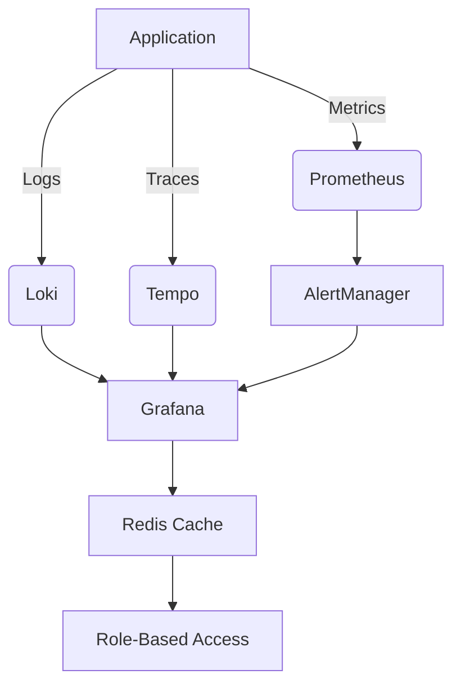

# Observability Stack Implementation Plan



## Phase 1: Metrics & Logs Implementation

### Metrics Collection (Prometheus)
```yaml
# docker-compose-metrics.yml
services:
  prometheus:
    image: prom/prometheus:v2.40.0
    volumes:
      - ./prometheus.yml:/etc/prometheus/prometheus.yml
      - redis_data:/data
    ports:
      - "9090:9090"

  redis_exporter:
    image: oliver006/redis_exporter:v1.45.0
    environment:
      - REDIS_ADDR=redis://redis:6379
    ports:
      - "9121:9121"
```

### Log Aggregation (Loki)
```php
// config/logging.php
'loki' => [
    'driver' => 'custom',
    'via' => \App\Logging\LokiLogger::class,
    'level' => 'debug',
    'tags' => ['env' => env('APP_ENV')],
    'batch_size' => env('LOKI_BATCH_SIZE', 100),
    'timeout' => env('LOKI_TIMEOUT', 5),
],
```

## Phase 2: Tracing & Alerts

### Distributed Tracing Configuration
```bash
# Install required packages
composer require open-telemetry/opentelemetry-php \
    open-telemetry/opentelemetry-php-exporter-otlp \
    open-telemetry/opentelemetry-php-sdk
```

## Phase 3: RBAC & Anomaly Detection

### Grafana RBAC Integration
```ini
# grafana/provisioning/auth/generic_oauth.ini
[auth.generic_oauth]
name = CMS
enabled = true
client_id = grafana-observability
client_secret = ${GF_AUTH_GENERIC_OAUTH_CLIENT_SECRET}
auth_url = http://cms/oauth/authorize
token_url = http://cms/oauth/token
api_url = http://cms/api/user
role_attribute_path = "contains(roles[*], 'admin') && 'Admin' || contains(roles[*], 'editor') && 'Editor' || 'Viewer'"
```

## Implementation Timeline

1. Day 1-3: Metrics infrastructure setup
2. Day 4-5: Log aggregation configuration
3. Day 6-7: Tracing implementation
4. Day 8: RBAC integration
5. Day 9-10: Anomaly detection rules

## Cost Estimates
- Prometheus/Loki/Tempo: $0 (self-hosted)
- Grafana Cloud: $299/month (optional)
- Redis Upgrade: $150/month (cache.redis.2xlarge)