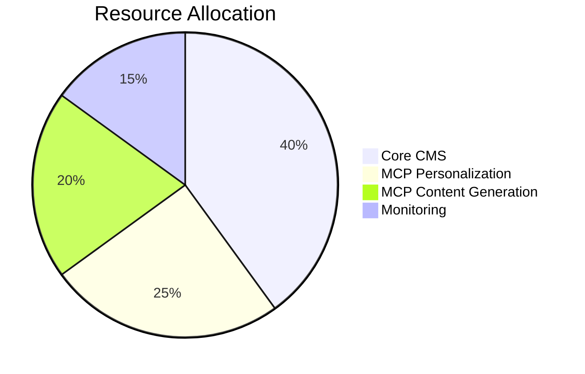

# Overnight CMS Development Plan

## 1. Task Breakdown

```mermaid
gantt
    title Overnight Development Tasks
    dateFormat  HH:mm
    axisFormat %H:%M
    section Core
    Database Migrations       :crit, 22:00, 60m
    Version Analytics        :22:30, 90m
    Content Scheduling UI    :23:00, 120m
    section Monitoring
    Performance Metrics      :22:00, 180m
    Error Tracking           :22:30, 150m
    section Maintenance
    Cache Warmup            :23:30, 60m
    Backup Verification     :00:30, 30m
```

| Task | Priority | Est. Time | Dependencies |
|------|----------|-----------|--------------|
| Database Migrations | Critical | 60m | None |
| Version Analytics | High | 90m | Database ready |
| Content Scheduling UI | High | 120m | Version Analytics complete |
| Performance Metrics | Medium | 180m | None |
| Error Tracking | Medium | 150m | None |
| Cache Warmup | Low | 60m | After peak hours |
| Backup Verification | Critical | 30m | All tasks complete |

## 2. Resource Allocation

| Mode | Tasks | Tools Required |
|------|-------|----------------|
| Code | Database, UI | Migration tools, IDE |
| Debug | Error tracking | Log monitoring |
| Architect | Performance metrics | Grafana, Prometheus |
| DB Support | Migrations, backups | Database clients |

## 3. Contingency Measures

### Error Recovery Protocols
1. **Database Migration Failure**:
   - Automatic rollback on error
   - Notify on-call engineer
   - Fallback to previous schema version

2. **Performance Degradation**:
   - Auto-scale additional instances
   - Disable non-critical features
   - Rollback recent changes

### Notification Triggers
- Migration failure
- Error rate > 1%
- Response time > 2s
- Queue backlog > 100 items

## 4. Communication Protocol

| Interval | Channel | Format |
|----------|---------|--------|
| Hourly | Slack | Summary of completed tasks |
| On Error | PagerDuty | Alert with severity |
| Completion | Email | Full report with metrics |

## 5. Milestones

1. **Initialization (22:00)**:
   - Verify system health
   - Start performance monitoring

2. **Core Development (22:00-01:00)**:
   - Complete database migrations
   - Implement version analytics
   - Deploy scheduling UI

3. **Validation (01:00-01:30)**:
   - Run integration tests
   - Verify backups
   - Check performance metrics

4. **Completion (01:30)**:
   - Final system check
   - Send completion report
   - Handover to monitoring