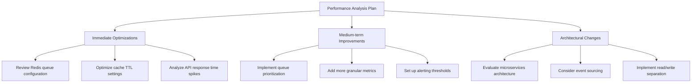

# CMS Performance Optimization Plan

## Current System Metrics
- **Grafana Dashboard Tracking**:
  - AI Content Generation Success Rate
  - API Response Times (95th percentile and median)
  - Moderation Queue Size
  - User Usage Metrics

- **Configuration**:
  - Redis queue processing (default, tracking, media queues)
  - Content version caching (1hr TTL)
  - Moderation queue caching (30min TTL)
  - Log retention: 14 days

## Optimization Recommendations

### 1. Immediate Optimizations

**Redis Queue Configuration**:
- Review worker allocation across queues
- Monitor queue backlogs during peak times
- Adjust retry_after (currently 90s) based on actual job durations

**Cache Optimization**:
- Analyze cache hit ratios
- Adjust TTL based on content update frequency
- Consider cache warming for high-priority content

**API Performance**:
- Identify endpoints with highest latency
- Review query patterns for slow endpoints
- Implement request caching where appropriate

### 2. Medium-term Improvements

**Queue Prioritization**:
- Implement priority queues for critical workflows
- Add dead-letter queues for failed jobs
- Monitor job completion times

**Enhanced Metrics**:
- Add database query performance metrics
- Track external service call durations
- Monitor cache hit/miss ratios

**Alerting**:
- Set thresholds for queue size alerts
- Configure API error rate alerts
- Implement SLA monitoring

### 3. Architectural Changes

**Microservices Evaluation**:
- Separate content generation service
- Isolate moderation queue processing
- Extract analytics processing

**Event Sourcing**:
- Implement for critical workflows
- Improve audit capabilities
- Enable better replay scenarios

**Database Optimization**:
- Read/write separation
- Query pattern analysis
- Index optimization