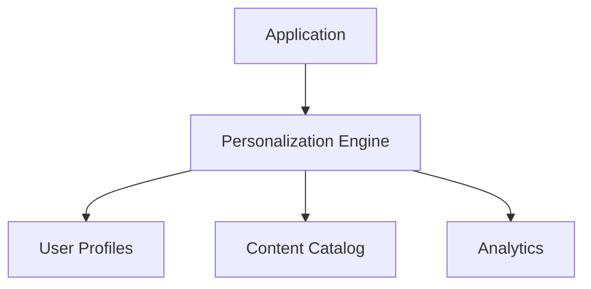

# Personalization System

## Overview
The Personalization System provides content recommendations, A/B testing, and user behavior tracking through the MCP Personalization Engine.

## Architecture

## Key Features

### Content Recommendations
- Personalized content suggestions
- Context-aware recommendations
- Collaborative filtering
- Content-based filtering

### A/B Testing Framework
- Experiment creation and management
- Variant allocation
- Performance tracking
- Statistical significance analysis

### User Behavior Tracking
- Clickstream collection
- Engagement metrics
- Preference inference
- Session analysis

## API Endpoints

### POST /recommend/content
Parameters:
- `userId`: User identifier
- `context`: Current context/state

### GET /recommend/content/:userId
Parameters:
- `userId`: User identifier

### POST /track/behavior
Parameters:
- `userId`: User identifier
- `event`: Behavior event type
- `data`: Event-specific data

### POST /abtest/create
Parameters:
- `name`: Test name
- `variants`: Test variants
- `targeting`: Audience targeting rules

## Performance Considerations
- Recommendation caching
- Batch processing for behavior analysis
- Database indexing for user profiles
- Horizontal scaling for A/B testing

## Integration Points
- Content management system
- Search enhancement service
- Analytics pipeline
- User profile service