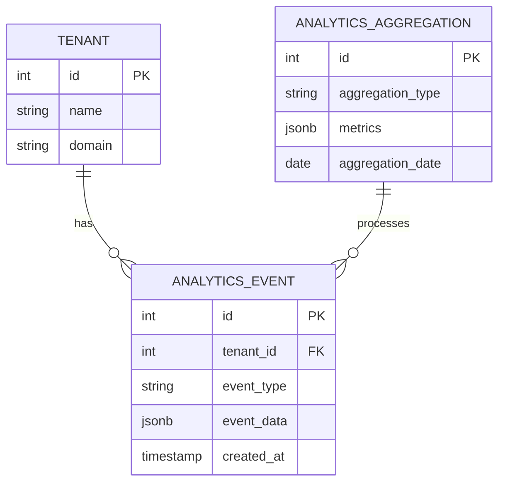

# Phase 10 Analytics Implementation Plan

## Data Model Architecture

## API Endpoints
1. **Event Collection**
   - `POST /api/analytics/events` - Record new analytics events
   - `GET /api/analytics/events` - Query events with filters

2. **Reporting**
   - `GET /api/analytics/summary` - Get aggregated metrics
   - `POST /api/analytics/query` - Custom analytics queries
   - `GET /api/analytics/export` - Export analytics data

## Implementation Phases
1. Database schema creation
2. Event collection service
3. Reporting API endpoints
4. Dashboard UI components
5. Testing and optimization

## Performance Considerations
- Database indexing strategy
- Query optimization
- Caching layer implementation
- Batch processing for aggregations

## Testing Strategy
- Unit tests for data collection
- Integration tests for API endpoints
- Performance tests for large datasets
- Tenant isolation verification