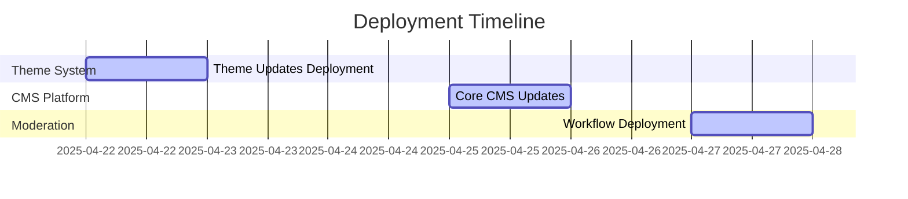

# April 2025 Deployment Post-Mortem Report

## Deployment Overview
- **Date Range**: April 22-27, 2025
- **Components Deployed**:
  - Theme Management System (April 22)
  - Main CMS Platform Updates (April 25)
  - Content Moderation Workflows (April 27)

## Timeline Review

## Issue Log Analysis
| Issue | Severity | Resolution | Root Cause |
|-------|----------|------------|------------|
| TBD   | TBD      | TBD        | TBD        |

## Performance Metrics
- **Theme System**:
  - Average load time: TBD
  - Compilation success rate: TBD
- **Moderation Workflows**:
  - Processing time: TBD
  - Accuracy: TBD

## User Feedback
- Collected from: [source]
- Key themes:
  1. TBD
  2. TBD

## Lessons Learned
1. TBD
2. TBD
3. TBD

## Action Items
- [ ] Complete metrics collection
- [ ] Gather user feedback
- [ ] Schedule retrospective meeting