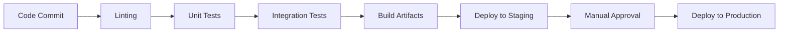

# CMS Production Deployment Guide

## 1. Environment Configuration

### Production .env Setup
```bash
cp .env.example .env.production
nano .env.production
```

Required configurations:
- `APP_ENV=production`
- `APP_DEBUG=false`
- Database credentials
- Cache configuration
- Queue configuration
- Monitoring services (Sentry, Grafana)

### Config Validation
```bash
php artisan config:validate
```

## 2. Deployment Checklist

### Pre-Deployment
- [ ] Run test suite: `php artisan test`
- [ ] Verify database migrations: `php artisan migrate:status`
- [ ] Check server requirements: `php artisan requirements:check`
- [ ] Backup current production

### Deployment Steps
1. Pull latest code
2. Run composer install: `composer install --optimize-autoloader --no-dev`
3. Run migrations: `php artisan migrate --force`
4. Clear caches: `php artisan optimize:clear`
5. Restart queue workers: `php artisan queue:restart`

### Post-Deployment Verification
- [ ] Smoke test API endpoints
- [ ] Verify monitoring dashboards
- [ ] Check queue worker status

## 3. CI/CD Pipeline

### Recommended Pipeline Stages


### Configuration Examples
- GitHub Actions: `.github/workflows/deploy.yml`
- GitLab CI: `.gitlab-ci.yml`

## 4. Rollback Procedures

### Code Rollback
```bash
git revert [commit-hash]
```

### Database Rollback
```bash
php artisan migrate:rollback --step=1
```

### Emergency Procedures
1. Identify last known good version
2. Restore database backup
3. Revert code changes
4. Verify system status

## Security Considerations
- [ ] Validate .env file permissions
- [ ] Review API rate limiting
- [ ] Verify HTTPS configuration
- [ ] Audit user permissions