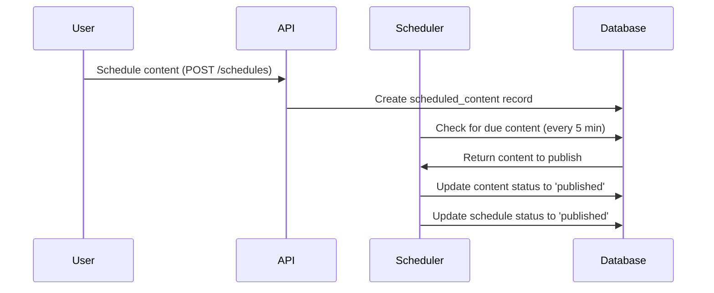

# Publishing Workflow Documentation

## Workflow Diagram


## States and Transitions

### Content States
1. `draft` - Initial state
2. `scheduled` - Content is queued for publishing
3. `published` - Content is live
4. `archived` - Content removed from public view
5. `expired` - Automatically archived after expiry

### Transition Rules
- Only authors/admins can schedule content
- Scheduled content must have valid publish_time
- Expiry is optional but must be after publish_time
- Content can be manually published before schedule

## Scheduler Configuration
```php
// config/scheduler.php
return [
    'check_interval' => 5, // minutes
    'max_batch_size' => 50,
    'retry_failed' => 3,
    'notification_emails' => [
        'admin@example.com'
    ]
];
```

## Error Handling
- Failed publishes are retried 3 times
- After failures, notification emails are sent
- System logs all publish attempts