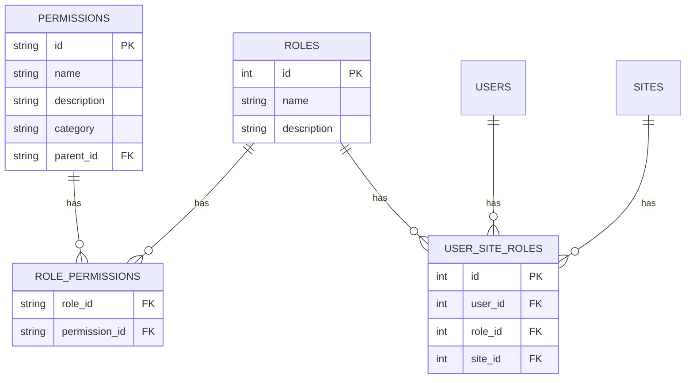

# RBAC Implementation

## Database Schema



## Core Components

1. **PermissionManager**
   - Handles permission definitions and hierarchy
   - Manages permission inheritance
   - Provides permission validation

2. **RoleManager** 
   - Manages role-permission assignments
   - Handles role creation/modification
   - Provides role validation

3. **AccessChecker**
   - Performs permission checks
   - Handles permission caching
   - Provides audit logging

4. **PermissionRegistry**
   - Central registry of all permissions
   - Handles permission discovery
   - Provides permission metadata

## Integration Points

1. **Authentication System**
   - Role assignments during user creation
   - Permission checks during login

2. **Routing Middleware**
   - Route-level permission checks
   - Automatic permission validation

3. **Admin Panel UI**
   - Role management interface
   - Permission assignment UI
   - Access control visualization

4. **Plugin System**
   - Plugin permission registration
   - Plugin-specific access controls
   - Permission-aware plugin loading

## Usage Examples

```php
// Check if user has permission
if ($accessChecker->hasPermission($user, 'content.edit')) {
    // Allow content editing
}

// Get all permissions for role
$permissions = $roleManager->getPermissionsForRole($roleId);

// Register new permission
$permissionManager->registerPermission([
    'id' => 'content.publish',
    'name' => 'Publish Content',
    'category' => 'content'
]);