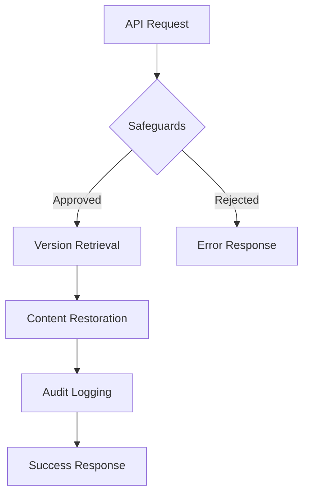

# Content Restoration System

## System Architecture


## API Reference

### Endpoints
| Method | Path | Description | Parameters |
|--------|------|-------------|------------|
| POST | `/api/restore/{id}` | Restores specific version | `id`: Version ID<br>`confirm`: Boolean override |
| GET | `/api/restore/preview/{id}` | Shows changes | `id`: Version ID |
| GET | `/api/restore/validate/{id}` | Checks restorability | `id`: Version ID |
| GET | `/api/restore/history` | Gets audit log | `page`, `per_page` |

### Example Request
```php
// Sample restoration request
$response = $http->post('/api/restore/123', [
    'confirm' => true,
    'reason' => 'Rollback incorrect edit'
]);
```

## Safety Mechanisms
1. **Recent Changes Check**
   ```php
   if ($lastEdit->isRecent(15)) { // Minutes
       throw new RestorationWarning('Recent changes detected');
   }
   ```

2. **Multi-Version Rollback**
   ```php
   if ($versionDiff > 5) {
       requireExtraConfirmation();
   }
   ```

3. **Content Type Protections**
   ```php
   if ($content->isSystemPage()) {
       logAdminApprovalRequired();
   }
   ```

## Audit Logging
Stores in `restoration_audit` table:
```sql
CREATE TABLE restoration_audit (
    id INT AUTO_INCREMENT,
    user_id INT,
    version_id INT,
    status ENUM('attempted','completed','failed'),
    ip_address VARCHAR(45),
    metadata JSON,
    created_at DATETIME
);
```

## Error Handling
| Code | Type | Example Response |
|------|------|------------------|
| 400 | Invalid Request | `{"error": "Invalid version ID"}` |
| 403 | Permission Denied | `{"error": "Insufficient rights"}` |
| 409 | Conflict | `{"warning": "Recent changes detected"}` |
| 500 | Server Error | `{"error": "Database connection failed"}` |

## Version History
- 2025-04-01: Initial implementation
- 2025-04-15: Added safeguard checks
- 2025-04-20: Enhanced audit logging
- 2025-05-01: Added content type protections