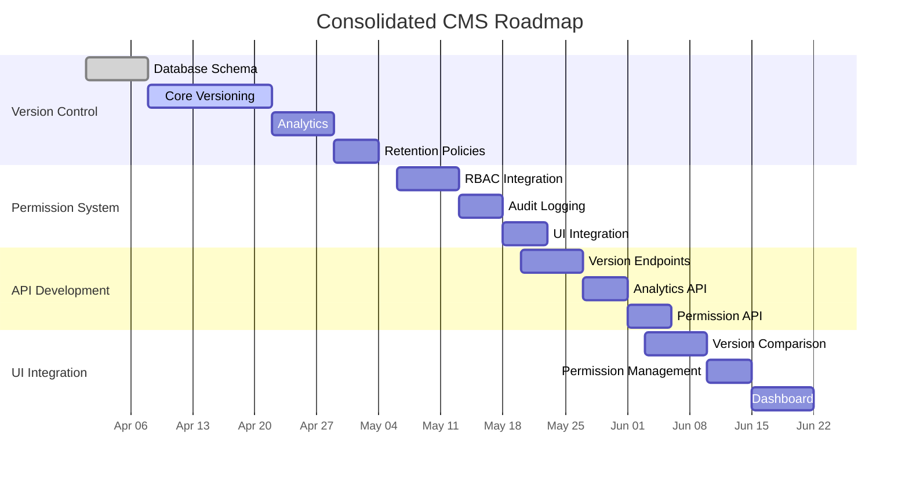

# CMS Implementation Roadmap (Updated Q2-Q3 2025)

## Current Implementation Status

### Version Control (80% complete)
- ✅ Database schema implemented
- ✅ Basic versioning working
- 🟡 Analytics in progress
- ❌ Retention policies not started

### Permission System (Not started)
- Requires RBAC package integration
- Needs audit logging implementation
- UI components to be developed

## Key Deliverables

1. **Version Control**
   - Complete analytics implementation
   - Add retention policies
   - Enhance diff visualization

2. **Permission System**  
   - Role-based access control
   - Permission matrix
   - Audit logging

3. **API Development**
   - Version control endpoints
   - Analytics endpoints
   - Permission management API

4. **UI Integration**
   - Version comparison interface
   - Permission management UI
   - Analytics dashboard

## Dependencies

- Version control must be stable before permission integration
- API endpoints needed before UI development
- Analytics depends on version data collection

## Risk Assessment

1. **Version Storage Growth**
   - Mitigation: Implement retention policies early

2. **Permission Performance**
   - Mitigation: Add caching layer

3. **UI Complexity**
   - Mitigation: Use component library