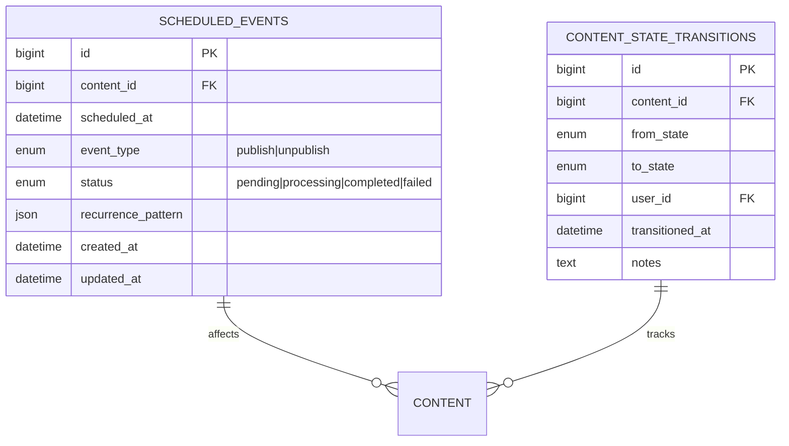

# Content Scheduling System Design

## Overview
Comprehensive scheduling system supporting:
- Minute/hour/day precision
- One-time and recurring schedules
- Publish/unpublish operations
- Conflict detection and resolution

## Database Schema

## API Endpoints
### Schedule Management
| Endpoint | Method | Description |
|----------|--------|-------------|
| `/api/schedules` | POST | Create new schedule |
| `/api/schedules/{id}` | PUT | Update schedule |
| `/api/schedules/{id}` | DELETE | Cancel schedule |
| `/api/schedules/conflicts` | GET | Check for conflicts |

### Calendar Views
| Endpoint | Method | Description |
|----------|--------|-------------|
| `/api/schedules/calendar` | GET | Calendar view |
| `/api/schedules/timeline` | GET | Timeline view |

## Background Processing
1. **Scheduled Job Worker**:
   - High-priority Redis queue
   - Automatic retry with exponential backoff
   - State validation pre-execution

2. **Conflict Resolution**:
   - Priority-based resolution system
   - Admin override capability
   - Email notifications for conflicts

## Frontend Components
1. **Scheduling Interface**:
   - Precision time picker
   - Recurrence pattern builder
   - Visual conflict indicators

2. **Calendar Visualization**:
   - Interactive day/week/month views
   - Color-coded event types
   - Drag-and-drop functionality

## Security Model
1. **Permission Levels**:
   - View schedules
   - Create schedules (requires approval)
   - Approve schedules
   - Manage recurring schedules

2. **Audit Logging**:
   - All schedule modifications
   - Approval actions
   - System-generated events