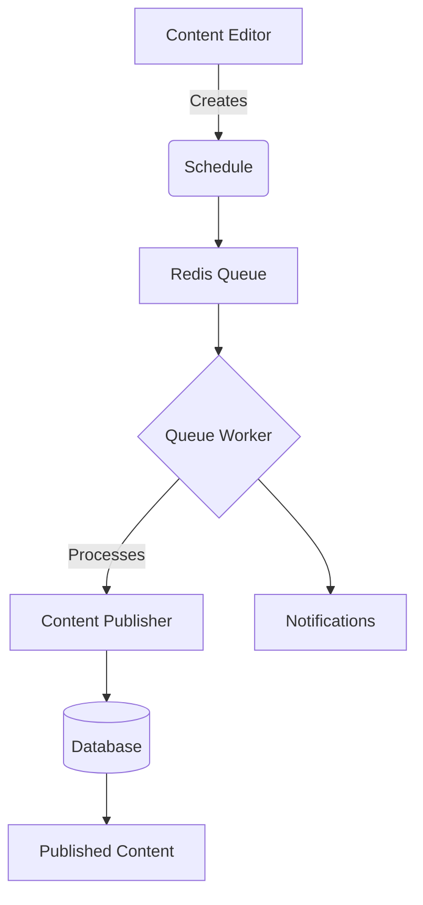

# Content Scheduling Admin Documentation

## System Architecture



## Queue Processing
- Scheduled jobs are added to the Redis `high` priority queue
- Workers process jobs using the following configuration:
  - 4 worker processes by default
  - 3 max retry attempts
  - 60 second timeout
  - Backoff intervals: 1s, 5s, 10s for high priority

## Monitoring
Key metrics to monitor:
1. Queue length (`high` priority)
2. Failed jobs count
3. Average processing time
4. Scheduled vs completed ratio

Access via:
- Redis CLI: `redis-cli LLEN queues:high`
- Admin dashboard: `/admin/queues`

## Troubleshooting

### Common Issues
1. **Stuck jobs**: 
   - Check worker logs
   - Restart workers if needed
2. **Timezone mismatches**:
   - Verify server timezone matches config
3. **Permission errors**:
   - Check job ownership and permissions

### Log Locations
- Worker logs: `/var/log/worker.log`
- Application logs: `/var/log/cms.log`
- Failed jobs: `failed_jobs` database table

## Configuration
Key settings in `config/queue.php`:
```php
'redis' => [
    'queue' => 'high,medium,low',
    'worker_processes' => 4,
    'max_tries' => 3,
    'backoff' => [
        'high' => [1, 5, 10],
    ]
]