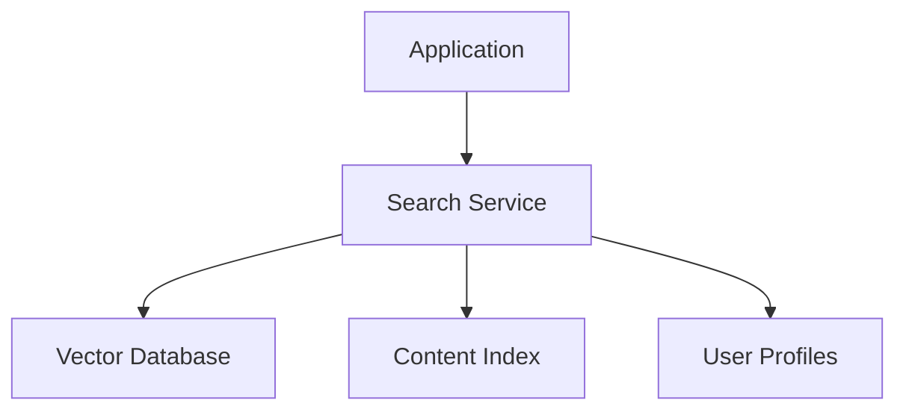

# Search Enhancement System

## Overview
The Search Enhancement System provides advanced search capabilities through the MCP Search Service, including semantic search, content reuse suggestions, and personalized results.

## Architecture

## Key Features

### Semantic Search
- Uses vector embeddings to find conceptually similar content
- Configurable similarity threshold (default: 0.7)
- Returns ranked results with similarity scores

### Content Reuse Suggestions
- Identifies reusable content fragments
- Tracks usage statistics
- Suggests relevant existing content

### Personalized Search
- Incorporates user preferences and behavior
- Adapts results based on past interactions
- Maintains search history context

## API Endpoints

### POST /search/semantic
Parameters:
- `query`: Search text
- `threshold`: Similarity threshold (0-1)
- `limit`: Maximum results to return

### GET /search/suggestions
Parameters:
- `q`: Query text

### POST /search/personalized
Parameters:
- `query`: Search text
- `userId`: User identifier

## Performance Considerations
- Vector database requires adequate memory
- Indexing should run during low-traffic periods
- Cache frequent queries
- Monitor latency for personalized searches

## Integration Points
- Content management system
- User profile service
- Analytics pipeline