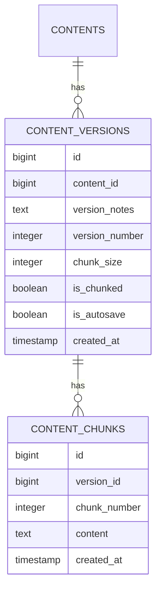

# Service Architecture: Chunked Version Control

## Overview
The chunked version control system breaks large content versions into manageable chunks to:
- Reduce memory usage during comparison
- Enable progressive loading
- Improve performance for large documents

## Database Schema

## API Flow
1. Client requests version comparison
2. Server checks if versions are chunked
3. For chunked versions:
   - Returns chunk metadata first
   - Client requests chunks progressively
   - Server streams chunks as requested
4. Comparison performed on client-side

## Performance Considerations
- Default chunk size: 10,000 characters
- Indexes on (version_id, chunk_number)
- Chunk checksum verification
- Parallel chunk loading

## Error Handling
- Partial chunk failures
- Version consistency checks
- Checksum validation