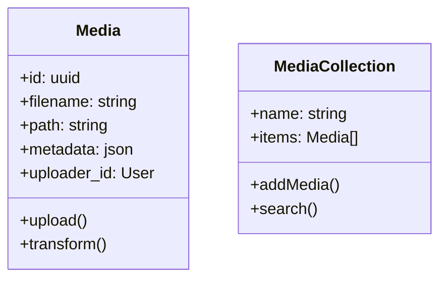

# CMS System Overview

## Current Architecture
- Laravel 10.x backend
- Livewire/Alpine.js for interactive components
- MySQL database
- Redis for queue/caching
- Vue.js for complex UIs (page builder planned)

## Implemented Features

### Version Management
- Complete version history tracking
- Branching support for parallel editing
- Visual comparison between versions
  - Side-by-side content viewing
  - Change highlighting
  - Detailed diff analysis
- One-click version restoration
  - Confirmation dialogs prevent accidental restores
  - Maintains full audit trail

### Core CMS
- Content management with versioning
- Workflow/approval system
- Category/tag management
- User roles/permissions
- Basic analytics

### Notification System
- Preferences management
- Email notifications
- In-app alerts
- Event-based triggers

## Pending Features

### Media Gallery

### Plugin System
- Hook points needed:
  - Content rendering
  - Dashboard widgets
  - API endpoints
  - Authentication flows

### n8n Integration
- Webhook endpoints:
  - `/api/webhooks/n8n/{workflow}`
  - Authentication via API tokens
  - Payload validation

### AI Page Builder
- Components needed:
  - Visual editor
  - Template system
  - AI suggestion engine
  - Preview/render system

### Themes System
- Directory structure:
  - `/themes/{name}/`
    - `views/`
    - `assets/`
    - `config.json`
  - Theme inheritance
  - Live preview

## Roadmap

1. Media Gallery (Priority)
   - Estimated: 2 weeks
   - Blocks: Page Builder implementation

2. Themes System
   - Estimated: 1 week
   - Required for consistent UI

3. AI Page Builder  
   - Estimated: 3 weeks
   - Depends on Media Gallery

4. Plugin System
   - Estimated: 2 weeks
   - Can run parallel

5. n8n Integration
   - Estimated: 1 week
   - Final phase
