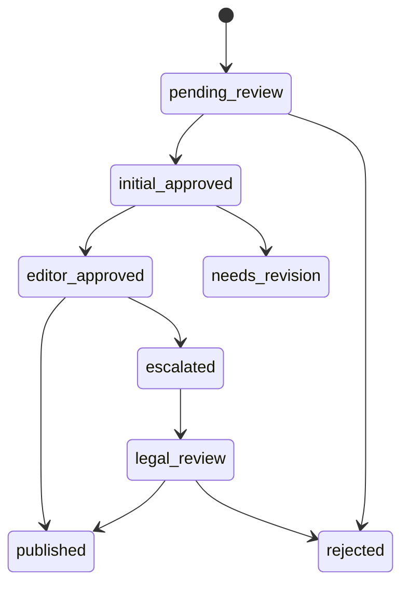
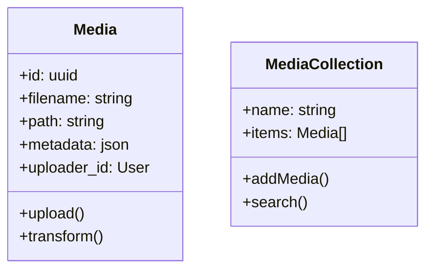

# CMS System Overview

## Current Architecture
- Laravel 10.x backend
- Livewire/Alpine.js for interactive components
- MySQL database
- Redis for queue/caching
- Vue.js for complex UIs (page builder planned)

## Implemented Features

### Version Management
- Complete version history tracking
- Branching support for parallel editing
- Visual comparison between versions
  - Side-by-side content viewing
  - Change highlighting
  - Detailed diff analysis
- One-click version restoration
  - Confirmation dialogs prevent accidental restores
  - Maintains full audit trail

### Core CMS
- Content management with versioning
- Workflow/approval system
- Category/tag management
- User roles/permissions
- Basic analytics

### Workflow System Architecture
- Polymorphic workflow assignments
- Standardized status values
- Performance thresholds:
  - Transition processing: ≤0.5s
  - History cleanup: ≤1.0s
  - Concurrent locks: 5s timeout
- Database locking mechanism
  - Optimistic locking for workflow transitions
  - Queue processing isolation

### Audit Logging Improvements
- Granular workflow transition logging
- Automated purge of old logs (30d retention)
- Contextual logging for:
  - Status changes
  - Assignment changes
  - Performance events
- Log analysis endpoints:
  - `/api/audit/workflows`
  - `/api/audit/performance`

### Notification System
- Preferences management
- Email notifications
- In-app alerts
- Event-based triggers

## Enhanced Workflow System

### New Status Values


### Polymorphic Assignment
- Supports multiple content types:
  - Content
  - Media
  - Comments
  - User profiles
- Dynamic workflow selection based on content type
- Customizable rules per content type

### Configurable Performance
```php
// config/performance.php
'workflows' => [
    'max_processing_time' => 0.5,
    'history_cleanup_time' => 1.0,
    'lock_timeout' => 5,
    'batch_size' => 50,
    'priority_weights' => [
        'content_type' => 0.3,
        'severity' => 0.4,
        'author' => 0.2,
        'age' => 0.1
    ]
]
```

### Database Locking
- Row-level locking for workflow transitions
- Table-level locking for batch operations
- Deadlock detection with automatic retry
- Lock wait timeout: 5s (configurable)

### Audit Logging
- `/api/audit/workflows` endpoint
- Logs include:
  - Status transitions
  - Moderator actions
  - System events
  - Performance metrics
  - Lock wait times
- Retention: 90 days (configurable)

## Pending Features

### Media Gallery


### Plugin System
- Hook points needed:
  - Content rendering
  - Dashboard widgets
  - API endpoints
  - Authentication flows

### n8n Integration
- Webhook endpoints:
  - `/api/webhooks/n8n/{workflow}`
  - Authentication via API tokens
  - Payload validation

### AI Page Builder
- Components needed:
  - Visual editor
  - Template system
  - AI suggestion engine
  - Preview/render system

### Themes System
- Directory structure:
  - `/themes/{name}/`
    - `views/`
    - `assets/`
    - `config.json`
  - Theme inheritance
  - Live preview

## Roadmap

1. Media Gallery (Priority)
   - Estimated: 2 weeks
   - Blocks: Page Builder implementation

2. Themes System
   - Estimated: 1 week
   - Required for consistent UI

3. AI Page Builder  
   - Estimated: 3 weeks
   - Depends on Media Gallery

4. Plugin System
   - Estimated: 2 weeks
   - Can run parallel

5. n8n Integration
   - Estimated: 1 week
   - Final phase
