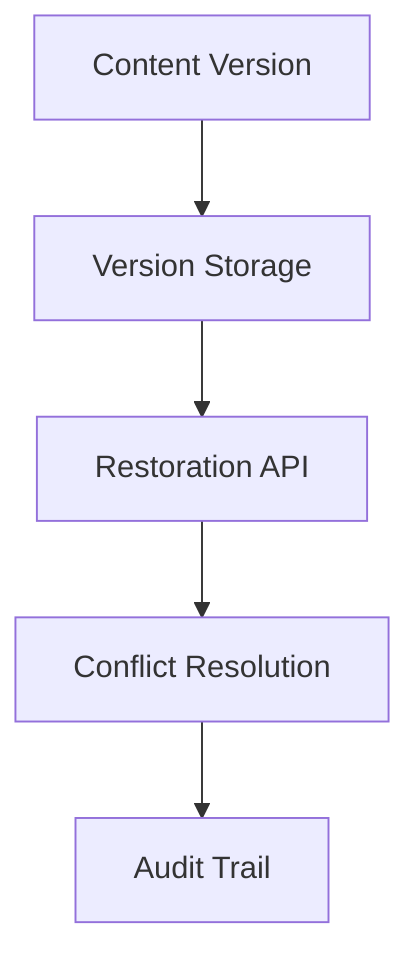
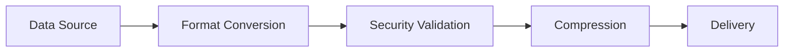
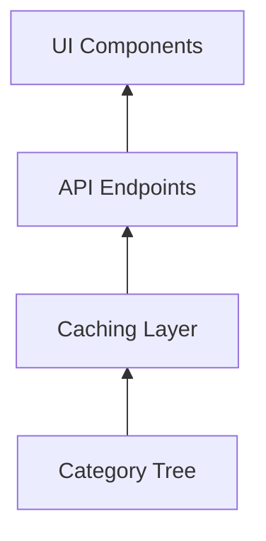
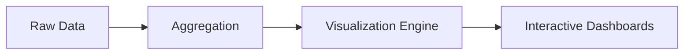
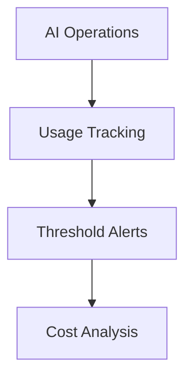
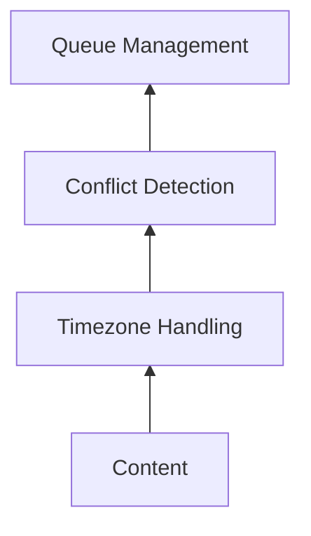
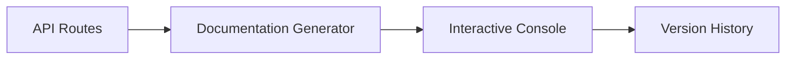
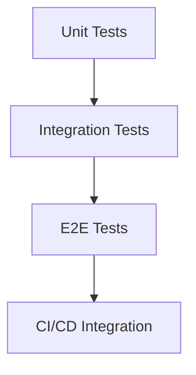
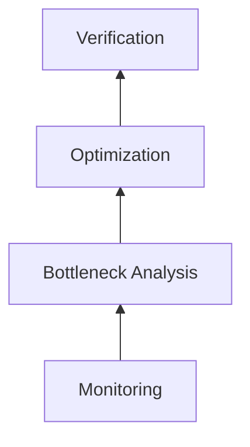
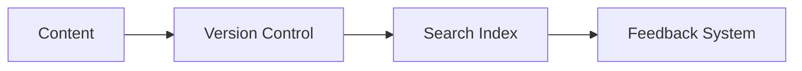

# Technical Specifications v2

## Version Comparison System Requirements

### GPU-Accelerated Path
- WebGL 2.0 support
- Modern GPU drivers (NVIDIA 450+, AMD 20.10+, Intel 27.20+)
- Minimum 2GB dedicated VRAM
- Chrome 90+, Firefox 88+, Safari 15.4+

### CPU Fallback Path
- SSE4.2 instruction set support
- 4GB+ system RAM
- All modern browsers supported

### Error Handling
- Automatic fallback to CPU rendering on:
  - WebGL context creation failure
  - Shader compilation errors
  - GPU memory allocation failures
  - Rendering timeouts (>500ms)

### Troubleshooting
```bash
# Check WebGL support in browser console
(() => {
    const canvas = document.createElement('canvas');
    const gl = canvas.getContext('webgl') || canvas.getContext('experimental-webgl');
    console.log('WebGL Support:', gl ? 'Available' : 'Unavailable');
    
    if (gl) {
        const debugInfo = gl.getExtension('WEBGL_debug_renderer_info');
        console.log('GPU Vendor:', debugInfo ? gl.getParameter(debugInfo.UNMASKED_VENDOR_WEBGL) : 'Unknown');
        console.log('GPU Model:', debugInfo ? gl.getParameter(debugInfo.UNMASKED_RENDERER_WEBGL) : 'Unknown');
    }
})();
```

## 1. Version Restoration System


Key Features:
- Content version history management
- Point-in-time restoration
- Conflict detection and resolution
- Comprehensive audit logging

## 2. Export Processing Pipeline


Key Features:
- Multiple export formats (JSON/CSV/XML)
- Data encryption options
- Automated cleanup
- Status tracking

## 3. Enhanced Category Management


Key Features:
- Hierarchical organization
- Bulk operations
- SEO optimization
- Content association

## 4. Analytics Visualization


Key Features:
- Custom report builder
- Real-time updates
- Role-based access
- Export capabilities

## 5. AI Usage Monitoring


Key Features:
- Detailed operation logging
- Anomaly detection
- Usage quotas
- Cost estimation

## 6. Content Scheduling


Key Features:
- Calendar interface
- Preview functionality
- Approval workflows
- Historical tracking

## 7. API Documentation


Key Features:
- Automatic generation
- Try-it functionality
- Example code
- Rate limit info

## 8. Testing Framework


Key Features:
- Coverage reporting
- Parallel execution
- Mock services
- Performance testing

## 9. Performance Optimization


Key Features:
- Profiling tools
- Caching strategies
- Query optimization
- Load testing

## 10. User Documentation


Key Features:
- Versioned documentation
- Full-text search
- User feedback
- Multimedia support