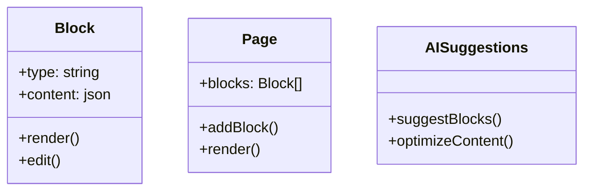

# Technical Specifications

## Media Gallery Implementation

### Database Schema
```php
Schema::create('media', function (Blueprint $table) {
    $table->uuid('id')->primary();
    $table->string('filename');
    $table->string('path');
    $table->json('metadata')->nullable();
    $table->foreignId('user_id')->constrained();
    $table->timestamps();
});

Schema::create('media_collections', function (Blueprint $table) {
    $table->id();
    $table->string('name');
    $table->string('slug')->unique();
    $table->timestamps();
});

Schema::create('media_collection_items', function (Blueprint $table) {
    $table->foreignUuid('media_id')->constrained();
    $table->foreignId('collection_id')->constrained('media_collections');
    $table->integer('order')->default(0);
    $table->primary(['media_id', 'collection_id']);
});
```

### API Endpoints
- `GET /api/media` - List media
- `POST /api/media` - Upload new media
- `GET /api/media/{id}` - Get media details
- `DELETE /api/media/{id}` - Delete media
- `GET /api/collections` - List collections
- `POST /api/collections` - Create collection

## Plugin System Architecture

### Core Components
1. **Plugin Manifest**
```json
{
  "name": "example-plugin",
  "version": "1.0.0",
  "hooks": {
    "content.render": "App\\Plugins\\Example\\ContentHook"
  }
}
```

2. **Hook System**
```php
// Registration
Hook::register('content.render', ContentHook::class);

// Execution
$content = Hook::execute('content.render', $content);
```

## n8n Integration

### Webhook Configuration
```php
Route::post('/webhooks/n8n/{workflow}', [N8nController::class, 'handle'])
    ->middleware('auth:n8n');

// Authentication
Schema::create('n8n_tokens', function (Blueprint $table) {
    $table->string('token')->primary();
    $table->string('description');
    $table->timestamps();
});
```

## AI Page Builder

### Component Structure


## Themes System

### File Structure
```
/themes/
  /default/
    /views/
      layouts/
        app.blade.php
    /assets/
      css/app.css
      js/app.js
    config.json
```

### Theme Config
```json
{
  "name": "Default",
  "extends": null,
  "styles": {
    "primary": "#3b82f6",
    "secondary": "#64748b" 
  }
}
