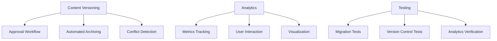
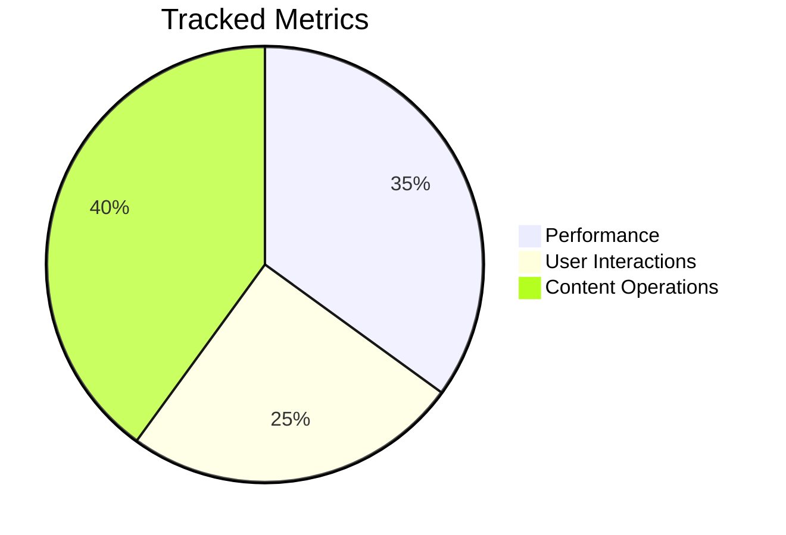
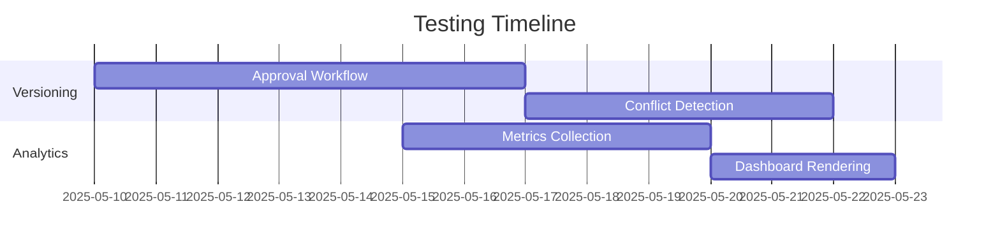

# CMS Phase 2 Technical Specification



## 1. Content Versioning Enhancements

### Approval Workflow Integration
- **Database Changes**:
  ```php
  Schema::table('content_versions', function (Blueprint $table) {
      $table->enum('status', ['draft', 'pending_review', 'approved', 'rejected'])->default('draft');
      $table->json('approval_history')->nullable();
      $table->foreignId('approver_id')->nullable()->constrained('users');
  });
  ```
- **Workflow Options**:
  - Single-approver (default)
  - Role-based multi-level approval
  - Content-type specific flows

### Automated Version Archiving
- **Strategy**:
  - Nightly job to archive versions older than 30 days
  - Store in compressed format in S3/object storage
  - Maintain metadata in database
- **Implementation**:
  ```php
  // Artisan command
  protected $signature = 'content:archive-versions {--days=30}';
  ```

### Conflict Detection  
- **Detection Methods**:
  - Concurrent edit detection via content hashing
  - Line-by-line change analysis
  - Semantic similarity threshold (90%+)
- **Resolution**:
  - Merge suggestions
  - Version comparison interface
  - Approval override option

## 2. Analytics Improvements

### Metrics Tracking


### Dashboard Enhancements
- New widgets:
  - Approval workflow metrics
  - Version history timeline
  - Conflict resolution stats
- Custom visualization options

## 3. Testing Strategy

### Test Coverage Plan


## Implementation Timeline
| Component          | Phase 1 (2w) | Phase 2 (2w) | Phase 3 (1w) |
|--------------------|--------------|--------------|--------------|
| Approval Workflow  | DB + Core    | UI           | Testing      |
| Version Archiving  | Architecture | Implementation | Optimization |
| Conflict Detection | Research     | Core Logic   | UI           |

## Documentation Updates
1. Update `technical-specs.md` with:
   - New database schema
   - API endpoints
   - Workflow diagrams
2. Create `versioning-workflows.md` guide
3. Add analytics documentation
