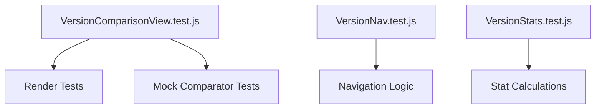

# Version Comparison Testing Methodology

## Test Strategy
- **Unit Tests**: 100% coverage of core comparison logic
- **Integration Tests**: Verify component interactions
- **Snapshot Tests**: Ensure consistent diff output

## Test Structure

### Backend Tests
- `VersionComparatorTest.php`
  - Tests HTML comparison accuracy
  - Verifies diff output format
- `SemanticVersionComparatorTest.php`  
  - Tests version parsing
  - Verifies comparison results

### Frontend Tests


## Test Cases

### Core Comparison Tests
1. **Identical Content**: Verify empty diff
2. **Added Content**: Verify + markers
3. **Removed Content**: Verify - markers  
4. **Mixed Changes**: Verify combined diff
5. **Invalid Input**: Verify error handling

### Semantic Version Tests
1. **Major Version Differences**
2. **Minor Version Differences**
3. **Patch Version Differences**
4. **Prerelease Versions**
5. **Invalid Version Strings**

## Test Configuration
- **Jest**: Configured for JS DOM environment
- **Coverage**: HTML and text reports
- **Ignored**: node_modules and test directories

## Running Tests
```bash
# Run all tests
npm test

# Run with coverage
npm test -- --coverage