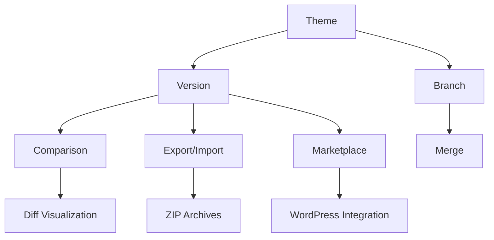
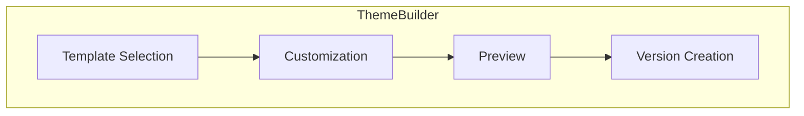
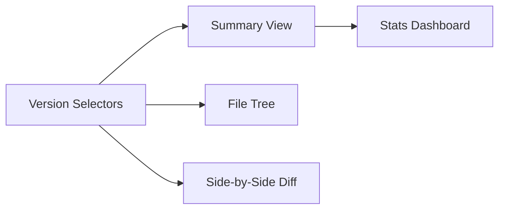
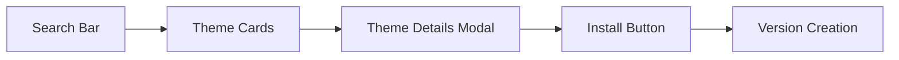
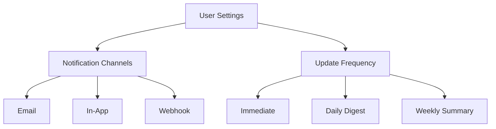
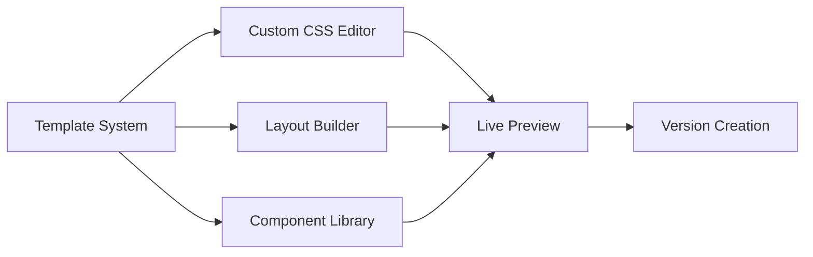

# Theme Versioning System Documentation



## Overview
The CMS includes a robust theme versioning system that allows:
- Version control for theme files and configurations
- Branching for parallel development
- Visual comparison between versions
- Rollback capabilities
- Export/import functionality

## Core Components

### 1. Models
- `Theme`: Represents a theme
- `ThemeVersion`: Stores version metadata and file changes
- `ThemeBranch`: Manages parallel development branches
- `ThemeVersionComparisonStat`: Tracks comparison metrics

### 2. Services
- `ThemeService`: Core theme operations
- `VersionComparisonService`: Diff and comparison logic
- `ThemeVersionController`: API endpoints

### 3. Database Tables
- `themes`: Theme metadata
- `theme_versions`: Version history
- `theme_branches`: Branch management
- `theme_version_comparison_stats`: Comparison analytics

## UI Components

### Theme Builder Interface


Key elements:
- Template gallery with previews
- Live customization panel
- Real-time preview pane
- Version creation form

### Version Comparison UI


Features:
- Color-coded diff visualization
- Interactive file tree
- Change statistics
- Rollback controls

## Version Management Workflow

### Creating Versions
```php
// Create new version from current theme state
$version = $themeService->createVersion(
    $theme,
    'Added dark mode support',
    $parentVersion
);
```

### Version States
- `draft`: Newly created, not active
- `published`: Available for activation
- `archived`: Historical, cannot activate
- `active`: Currently deployed version

### Activating Versions
```php
// Activate a specific version
$themeService->activateThemeVersion($version);

// Get active version
$activeVersion = $themeService->getActiveTheme()->versions()->active()->first();
```

## Branching Model

### Creating Branches
```php
// Create new branch from version
$branch = $theme->branches()->create([
    'name' => 'feature/dark-mode',
    'base_version_id' => $baseVersion->id
]);
```

### Branch Operations
- Merge branches
- Set default branch
- Protect branches from deletion
- Compare branches

## Version Comparison

### Size Metrics Comparison
The system provides detailed size comparison metrics between theme versions through the `ThemeSizeComparison` component.

#### Metrics Tracked
- **Total Size**: Overall theme package size in KB
- **Assets Size**: Combined size of all asset files (images, fonts, etc.)
- **Templates Size**: Combined size of all Blade template files
- **Scripts Size**: Combined size of all JavaScript files
- **Styles Size**: Combined size of all CSS files

#### Component Features
The `<x-theme-size-comparison>` component provides:
1. Side-by-side size metrics for both versions
2. Absolute difference calculations
3. Automatic null value handling (treats null as 0)
4. Responsive design for all screen sizes
5. Color-coded indicators for positive/negative changes

#### Example Usage
```php
// In your controller
$version1 = ThemeVersion::find(1);
$version2 = ThemeVersion::find(2);

// In your Blade template
<x-theme-size-comparison 
    :version1="$version1" 
    :version2="$version2"
/>
```

#### Visualization
The size comparison now includes an interactive chart visualization using Chart.js that shows:
- Bar chart comparing total sizes
- Color-coded versions (blue for version 1, red for version 2)
- Responsive design that works on all screen sizes
- Automatic scaling of the Y-axis

The chart is implemented in the theme version comparison view (`resources/views/themes/versions/compare.blade.php`) and includes:

```blade
<div class="w-full h-96">
    <canvas id="sizeComparisonChart"></canvas>
</div>

@push('scripts')
    <script src="https://cdn.jsdelivr.net/npm/chart.js"></script>
    <script>
        document.addEventListener('DOMContentLoaded', function() {
            const ctx = document.getElementById('sizeComparisonChart').getContext('2d');
            const chart = new Chart(ctx, {
                type: 'bar',
                data: {
                    labels: ['Version {{ $version1->version }}', 'Version {{ $version2->version }}'],
                    datasets: [{
                        label: 'Total Size (KB)',
                        data: [
                            {{ $version1->total_size_kb }}, 
                            {{ $version2->total_size_kb }}
                        ],
                        backgroundColor: [
                            'rgba(54, 162, 235, 0.5)',
                            'rgba(255, 99, 132, 0.5)'
                        ],
                        borderColor: [
                            'rgba(54, 162, 235, 1)',
                            'rgba(255, 99, 132, 1)'
                        ],
                        borderWidth: 1
                    }]
                },
                options: {
                    responsive: true,
                    maintainAspectRatio: false,
                    scales: {
                        y: {
                            beginAtZero: true,
                            title: {
                                display: true,
                                text: 'Size (KB)'
                            }
                        }
                    }
                }
            });
        });
    </script>
@endpush
```

#### Calculation Logic
The component calculates metrics using:
```php
protected function calculateSizeMetrics()
{
    return [
        'version1' => [
            'total_size' => $this->version1->total_size_kb ?? 0,
            // ... other metrics
        ],
        'version2' => [
            'total_size' => $this->version2->total_size_kb ?? 0,
            // ... other metrics  
        ],
        'difference' => [
            'total_size' => ($this->version2->total_size_kb ?? 0) - ($this->version1->total_size_kb ?? 0),
            // ... other differences
        ]
    ];
}
```

#### Testing
The component includes comprehensive tests covering:
- Basic initialization
- Metric calculations
- Null value handling
- Negative differences
- View rendering

See `tests/Feature/ThemeSizeComparisonTest.php` for full test coverage.

#### Future Enhancements
Planned improvements include:
1. Interactive charts/graphs visualization
2. Side-by-side comparison bars
3. Historical trend analysis
4. Exportable comparison reports
5. Customizable threshold alerts

### Comparing Versions
```php
$diff = $comparisonService->compareVersions($oldVersion, $newVersion);
```

### Diff Output Format
```json
{
  "version_info": {
    "version_change": "major|minor|patch",
    "old_version": "1.0.0",
    "new_version": "2.0.0"
  },
  "summary": {
    "added_files": 3,
    "deleted_files": 1,
    "modified_files": 5,
    "changed_manifest_fields": 2
  },
  "files": {
    "added": [],
    "deleted": [],
    "modified": []
  }
}
```

### File-level Diffs
```php
$fileDiff = $comparisonService->getFileDiff(
    'views/layouts/app.blade.php',
    $oldVersion,
    $newVersion
);
```

## API Endpoints

### Version Management
- `GET /themes/{theme}/versions` - List versions
- `POST /themes/{theme}/versions` - Create version
- `GET /themes/{theme}/versions/{version}` - Get version details
- `POST /themes/{theme}/versions/{version}/activate` - Activate version
- `POST /themes/{theme}/versions/{version}/rollback` - Rollback to version

### Branch Management
- `GET /themes/{theme}/branches` - List branches
- `POST /themes/{theme}/branches` - Create branch
- `POST /themes/{theme}/branches/{branch}/merge` - Merge branch
- `POST /themes/{theme}/branches/{branch}/set-default` - Set default branch

### Comparison
- `GET /themes/{theme}/compare/{version1}/{version2}` - Compare versions
- `GET /themes/{theme}/versions/{version}/diff/{file}` - Get file diff

## Export/Import

### Exporting
```php
// Export single version
$exportPath = $themeService->exportVersion($version, 'zip');

// Export all versions
$exportPath = $themeService->exportAllVersions($theme);
```

### Importing
```php
// Install from uploaded file
$theme = $themeService->installTheme($uploadedFile);

// Install from marketplace
$theme = $themeService->installTheme($marketplaceFile, true);
```

## Marketplace Integration

### WordPressMarketplaceService
```php
class WordPressMarketplaceService {
    public function searchThemes(string $query): array;
    public function getThemeDetails(string $slug): array;
    public function downloadTheme(string $slug): string;
    public function installFromMarketplace(string $slug): Theme;
}
```

Workflow:
1. Search marketplace
2. Preview theme details
3. Download and install
4. Create initial version

### Marketplace UI Components


Features:
- Live search with debounce
- Responsive card grid
- Interactive previews
- One-click installation
- Version management post-install

## Theme Update Notifications

### Notification System
```php
class ThemeUpdateAvailable extends Notification {
    public function __construct(
        public Theme $theme,
        public ThemeVersion $newVersion
    ) {}

    public function via(User $user): array {
        return $user->preferredThemeUpdateChannels();
    }

    public function toMail(): MailMessage;
    public function toDatabase(): array;
    public function toBroadcast(): array;
}
```

### Notification Preferences


Features:
- Multi-channel delivery
- Customizable templates
- Update frequency controls
- Version comparison in notifications
- One-click update actions

## Theme Builder Implementation

### Livewire Component Structure
```php
class ThemeBuilder extends Component {
    public Theme $theme;
    public ThemeVersion $version;
    
    public function mount(Theme $theme): void;
    public function save(): void;
    public function preview(): void;
    public function createVersion(): ThemeVersion;
}
```

### Builder Features


Key capabilities:
- Drag-and-drop layout construction
- Real-time CSS editing with autocomplete
- Component property customization
- Template inheritance system
- Version snapshotting

## Database Schema

### themes
```sql
CREATE TABLE `themes` (
  `id` bigint unsigned NOT NULL AUTO_INCREMENT,
  `name` varchar(255) NOT NULL,
  `slug` varchar(255) NOT NULL,
  `description` text,
  `version` varchar(255) DEFAULT NULL,
  `is_active` tinyint(1) NOT NULL DEFAULT '0',
  `created_at` timestamp NULL DEFAULT NULL,
  `updated_at` timestamp NULL DEFAULT NULL,
  PRIMARY KEY (`id`),
  UNIQUE KEY `themes_slug_unique` (`slug`)
);
```

### theme_versions
```sql
CREATE TABLE `theme_versions` (
  `id` bigint unsigned NOT NULL AUTO_INCREMENT,
  `theme_id` bigint unsigned NOT NULL,
  `version` varchar(255) NOT NULL,
  `description` text,
  `changelog` text,
  `manifest` json DEFAULT NULL,
  `file_changes` json DEFAULT NULL,
  `is_active` tinyint(1) NOT NULL DEFAULT '0',
  `status` enum('draft','published','archived') NOT NULL DEFAULT 'draft',
  `created_at` timestamp NULL DEFAULT NULL,
  `updated_at` timestamp NULL DEFAULT NULL,
  PRIMARY KEY (`id`),
  FOREIGN KEY (`theme_id`) REFERENCES `themes` (`id`)
);
```

### theme_branches
```sql
CREATE TABLE `theme_branches` (
  `id` bigint unsigned NOT NULL AUTO_INCREMENT,
  `theme_id` bigint unsigned NOT NULL,
  `name` varchar(255) NOT NULL,
  `description` text,
  `is_default` tinyint(1) NOT NULL DEFAULT '0',
  `is_protected` tinyint(1) NOT NULL DEFAULT '0',
  `base_version_id` bigint unsigned DEFAULT NULL,
  `created_at` timestamp NULL DEFAULT NULL,
  `updated_at` timestamp NULL DEFAULT NULL,
  PRIMARY KEY (`id`),
  FOREIGN KEY (`theme_id`) REFERENCES `themes` (`id`),
  FOREIGN KEY (`base_version_id`) REFERENCES `theme_versions` (`id`)
);
```

## Example Workflows

### 1. Creating and Publishing a New Version
1. Make changes to theme files
2. Create new version:
   ```php
   $version = $themeService->createVersion(
       $theme, 
       'Updated color scheme',
       $previousVersion
   );
   ```
3. Validate version:
   ```php
   $errors = $themeService->validateVersion($version);
   ```
4. Publish version:
   ```php
   $themeService->publishVersion($version);
   ```
5. Activate version:
   ```php
   $themeService->activateThemeVersion($version);
   ```

### 2. Comparing Versions
1. Select versions to compare
2. Get comparison:
   ```php
   $diff = $comparisonService->compareVersions($v1, $v2);
   ```
3. View file-level changes:
   ```php
   $fileDiff = $comparisonService->getFileDiff(
       'assets/css/app.css',
       $v1,
       $v2
   );
   ```

### 3. Branching Workflow
1. Create feature branch:
   ```php
   $branch = $theme->branches()->create([
       'name' => 'feature/new-layout',
       'base_version_id' => $stableVersion->id
   ]);
   ```
2. Make changes in branch
3. Merge to main branch:
   ```php
   $themeService->mergeBranch($featureBranch, $mainBranch);
