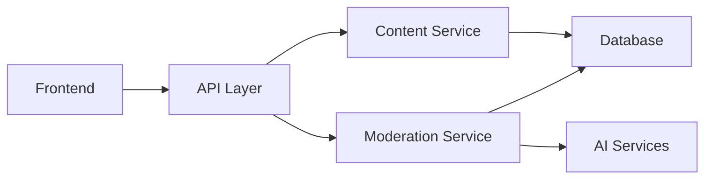

# CMS Operations Training Manual

## System Overview


## Key Workflows
### Content Moderation
1. **Automated Review**:
   - AI analysis (config/content_moderation.php)
   - Priority scoring (database/migrations/2025_04_25_113800_add_priority_to_moderation_queue.php)
2. **Manual Review**:
   - Access via `/moderation` interface
   - Approval workflows (config/content_moderation.php)

### Monitoring Procedures
- **Critical Dashboards**:
  - `Content Throughput`
  - `Moderation Queue Size`
  - `AI Usage Metrics`
- **Alert Response**:
  ```bash
  # Check service status
  php artisan system:status
  
  # View recent errors
  php artisan logs:errors --last=1h
  ```

## Troubleshooting Guide
| Symptom | First Steps | Escalation Path |
|---------|------------|-----------------|
| High moderation queue | Check AI service status → Verify database connections | Notify AI team |
| Slow content loading | Check cache hit rate → Verify storage performance | Infrastructure team |
| Failed deployments | Review deployment logs → Check migration status | DevOps team |

## Escalation Procedures
1. **Primary Contacts**:
   - Infrastructure: Jane Doe (jane@example.com)
   - AI Services: John Smith (john@example.com)
   - Database: DB Team (db-team@example.com)
2. **On-Call Rotation**:
   - Schedule in `shared/oncall_schedule.md`
   - PagerDuty integration configured

## Maintenance Schedule
- **Daily**: 08:00 System Checks
- **Weekly**: Sunday 02:00-04:00 Maintenance Window
- **Monthly**: First Tuesday Security Updates