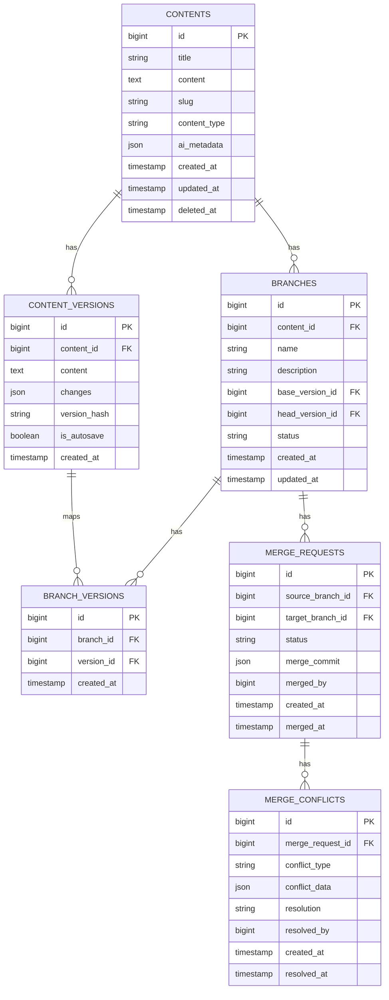

# Version Branching/Merging System Design

## Database Schema

## API Endpoints

### Branch Management
- `POST /api/contents/{id}/branches` - Create new branch
- `GET /api/contents/{id}/branches` - List branches
- `GET /api/branches/{id}` - Get branch details
- `DELETE /api/branches/{id}` - Delete branch

### Version Operations
- `POST /api/branches/{id}/versions` - Create version in branch
- `GET /api/branches/{id}/versions` - List branch versions

### Merge Operations
- `POST /api/merge-requests` - Create merge request
- `GET /api/merge-requests/{id}/conflicts` - List merge conflicts
- `POST /api/merge-requests/{id}/resolve` - Resolve conflict
- `POST /api/merge-requests/{id}/complete` - Complete merge

### Comparison
- `GET /api/branches/{id}/compare/{otherBranchId}` - Compare branches
- `GET /api/versions/{id}/diff/{otherVersionId}` - Get version diff

## Background Processing

### Merge Job Queue
- Processes merge requests asynchronously
- Detects and records conflicts
- Sends notifications

### Conflict Detection Service
- Content diffing
- Structural conflict detection
- Metadata conflict detection

### Notification System
- Merge request status updates
- Conflict alerts
- Merge completions

## Frontend Components

### Branch Visualization
- Interactive branch graph
- Version timeline
- Diff viewer

### Merge Interface
- Side-by-side comparison
- Conflict resolution tools
- Merge preview

### Branch Management
- Create/edit branches
- Version history
- Branch permissions

## Security Model

### Branch Permissions
- Role-based access control
- Branch-level permissions
- Ownership model

### Merge Approvals
- Required approvers
- Approval workflows
- Audit trail

### Audit Logging
- Branch operations
- Merge activities
- Conflict resolutions