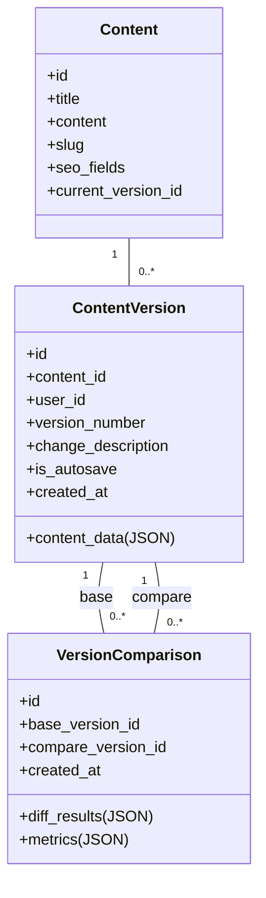

# Content Version Comparison System

## Architecture Overview



## Key Components

1. **Comparison Service**
   - Text diffing (line-by-line comparison)
   - Field-level comparison (for structured content)
   - Similarity scoring (percentage match)
   - Change highlighting

2. **API Endpoints**
   - POST /api/content/{id}/compare
   - GET /api/comparisons/{id}
   - GET /api/content/{id}/comparisons

3. **Storage Layer**
   - VersionComparison model
   - Stores diff results as JSON
   - Tracks comparison metrics

4. **Frontend UI**
   - Side-by-side comparison view
   - Change highlighting
   - Version selector

## Implementation Steps

1. Create VersionComparison model and migration
2. Implement comparison service with:
   - Text diffing algorithm
   - JSON field comparison
   - Similarity scoring
3. Add API routes and controllers
4. Create frontend components:
   - Comparison view
   - Version selector
   - Diff visualization
5. Add automated tests

## Database Schema

```php
Schema::create('version_comparisons', function (Blueprint $table) {
    $table->id();
    $table->foreignId('content_id')->constrained()->cascadeOnDelete();
    $table->foreignId('base_version_id')->constrained('content_versions');
    $table->foreignId('compare_version_id')->constrained('content_versions');
    $table->json('diff_results');
    $table->json('metrics');
    $table->timestamps();
});
```

## Next Steps

1. Implement the comparison service
2. Create API endpoints
3. Build frontend UI components