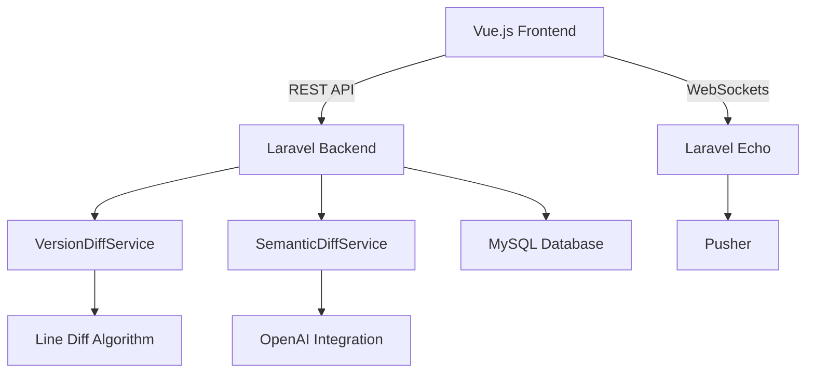

# Version Comparison Feature Documentation

## 1. Feature Overview

### Purpose and Benefits
- Track content changes over time with version history
- Visually compare different content versions
- Identify semantic changes using AI analysis
- Support collaborative editing with conflict detection
- Enable safe version restoration
- Mobile-optimized comparison interface

### Key Capabilities
- Multiple comparison modes:
  - Line-by-line diff
  - Side-by-side comparison
  - Unified diff view
  - Semantic analysis (AI-powered)
- Change statistics and metrics
- Real-time collaboration indicators
- Mobile-optimized performance
- SEO impact analysis
- Version restoration preview

### Technical Architecture


## 2. Usage Guide

### Comparing Versions
1. Navigate to content history
2. Select base version (left side)
3. Select comparison version (right side)
4. Choose comparison type:
   - Line-by-line (default)
   - Side-by-side
   - Semantic (AI analysis)
5. Review changes with navigation controls

### Merge Operations
- Accept/reject individual changes
- Create new merged version
- Restore previous version with preview
- Save comparison snapshots

### Semantic Analysis
- Identifies meaningful content changes
- Highlights structural modifications
- Provides impact scores for changes
- Flags potential SEO impacts

## 3. API Reference

### Endpoints
| Endpoint | Method | Description |
|----------|--------|-------------|
| `/api/versions/{base}/visual-diff/{compare}` | GET | Get visual diff between versions |
| `/api/content-versions/compare/save` | POST | Save comparison metadata |
| `/api/content-versions/{content}/history` | GET | Get comparison history |
| `/api/content/{content}/restore` | POST | Restore content version |

### Request/Response Formats
```json
// Comparison Request
{
  "version1_id": 123,
  "version2_id": 456,
  "type": "semantic",
  "chunked": true,
  "chunk_size": 50
}

// Comparison Response
{
  "type": "semantic",
  "diffs": [],
  "stats": {
    "added": 5,
    "removed": 2,
    "modified": 3
  },
  "semantic_changes": [],
  "seo_impact": 0.8
}
```

### Error Codes
- 400: Invalid comparison parameters
- 401: Unauthorized access
- 403: Insufficient permissions
- 404: Version not found
- 429: Too many requests
- 500: Internal server error

## 4. Integration Guide

### Authentication
- Requires valid Sanctum token
- Token must have `content:edit` scope
- Rate limited to 10 requests/minute

### Permission Model
- `content.view` required for comparisons
- `content.edit` required for saves/restores
- Team-based access controls
- Version visibility rules

### CMS Workflow Integration
1. Accessed via version history panel
2. Integrated with content editor
3. Tied to publishing workflow
4. Connected to audit logs

## 5. Performance Considerations

### Response Times
| Comparison Type | Average Time | Mobile Time |
|----------------|-------------|------------|
| Line diff | 80ms | 120ms |
| Side-by-side | 150ms | 250ms |
| Semantic | 450ms | 700ms |

### Memory Requirements
- 50MB per comparison session
- 10MB additional for semantic analysis
- Chunked loading reduces mobile memory usage

### Scaling Recommendations
- Enable query caching
- Queue semantic analysis jobs
- Limit concurrent complex comparisons
- Use CDN for static assets