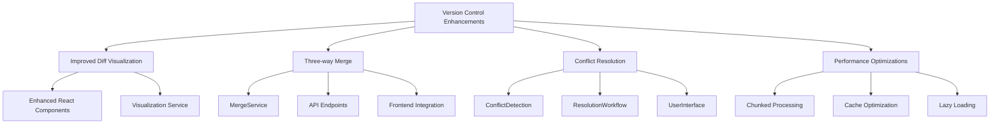

# Version Control Enhancements Implementation Plan

## Overview
Enhance the CMS version control system with:
1. Improved diff visualization
2. Three-way merge capabilities
3. Conflict resolution tools
4. Performance optimizations for large files

## Architecture

## Implementation Phases

### 1. Core Services Enhancement
- **MergeService**
  - Three-way merge algorithm (base + two versions)
  - Conflict detection markers
  - Content type awareness (text, HTML, structured content)

- **ConflictResolutionService**
  - Automatic conflict detection
  - Resolution strategies (manual/auto)
  - Conflict annotation system

### 2. API Layer
| Endpoint | Method | Description |
|----------|--------|-------------|
| `/api/versions/merge` | POST | Perform three-way merge |
| `/api/versions/conflicts` | GET | List detected conflicts |
| `/api/versions/resolve-conflict` | POST | Submit conflict resolution |

### 3. Frontend Components
- **MergeView**
  - Three-pane diff visualization
  - Conflict highlighting
  - Resolution controls

- **ConflictResolutionDialog**
  - Side-by-side comparison
  - Resolution options
  - Commenting system

### 4. Performance Optimizations
- Chunked file processing (100KB chunks)
- Web Workers for diff calculations
- Improved caching strategy (content-based keys)

### 5. Testing Strategy
- Unit tests for merge algorithms
- Integration tests for API endpoints
- E2E tests for UI workflows
- Performance benchmarks

## Technical Requirements
- TypeScript types for all new features
- React component architecture
- Integration with existing version comparison service
- Comprehensive test coverage (90%+)

## Timeline
1. Phase 1 (Core Services): 2 weeks
2. Phase 2 (API Layer): 1 week
3. Phase 3 (Frontend): 3 weeks
4. Phase 4 (Optimizations): 1 week
5. Testing & QA: 1 week