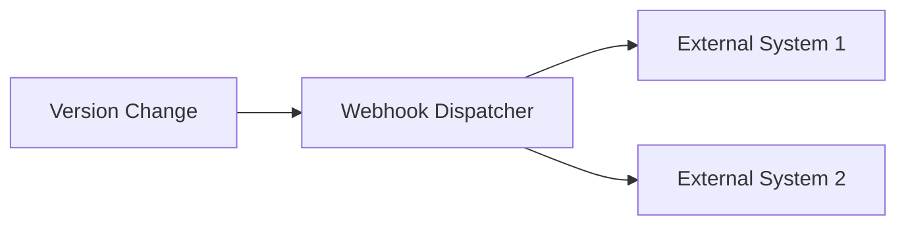
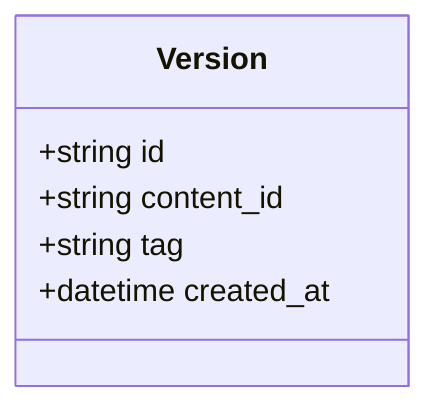
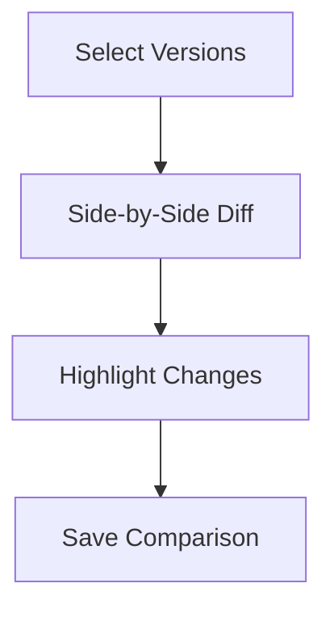

# Version Control System Specifications 2025

## 1. API Enhancements

### Webhook System

### Bulk Operations
- POST `/content/{content}/versions/bulk-compare`
- POST `/content/{content}/versions/bulk-restore`

### Tagging System

## 2. Database Optimization

| Optimization | Target | Expected Improvement |
|-------------|--------|----------------------|
| Composite Indexes | version_comparisons | 40% faster queries |
| Redis Caching | frequent_version_access | 80% reduced DB load |
| Table Partitioning | content_versions | 60% faster archival |

## 3. UI Requirements

### Version Comparison

## 4. Implementation Timeline

1. **Phase 1 (2 weeks)**
   - Webhook system implementation
   - Database index optimization

2. **Phase 2 (3 weeks)**
   - Bulk operations API
   - Comparison UI components

3. **Phase 3 (1 week)**
   - Tagging system
   - Analytics dashboard

4. **Phase 4 (1 week)**
   - Performance testing
   - Final optimizations