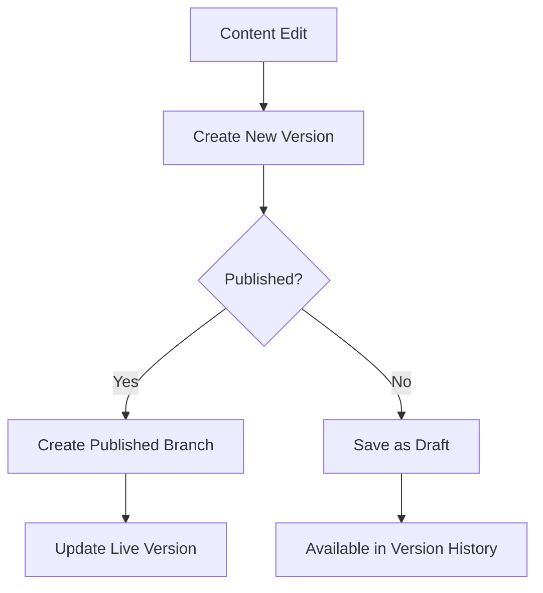

# Versioned Content System Architecture

## Overview
The CMS implements a comprehensive version control system for all content types, supporting:
- Full version history
- Content comparisons
- Branching and merging
- Scheduled publishing
- Automated archiving



## Core Components

### Version Storage
- Uses polymorphic relationships
- Stores complete content snapshots
- Compresses older versions
- Maintains revision metadata:
  - Author
  - Timestamp
  - Change notes
  - Content type

### Version API
```php
// Create new version
$version = $content->createVersion([
    'notes' => 'Updated product details',
    'is_autosave' => false
]);

// Compare versions
$diff = $content->compareVersions($v1, $v2);

// Restore version
$content->restoreVersion($versionId);
```

## Workflow Examples

### Creating a New Version
1. User edits content
2. System creates new version record
3. Stores complete content snapshot
4. Updates version metadata

### Comparing Versions
```javascript
// API request
POST /api/content/{id}/compare
{
    "version1": 42,
    "version2": 45
}

// Response
{
    "differences": [
        {
            "field": "title",
            "old": "Original Title",
            "new": "Updated Title"
        }
    ],
    "similarity": 0.85,
    "lines_changed": 12
}
```

### Comparison Features

**View Modes:**
- **Line-by-line:** Traditional diff view showing exact changes
- **Side-by-side:** Parallel columns showing both versions
- **Semantic:** Intelligent analysis of content structure changes

**Collaboration Features:**
- Real-time annotations and comments
- Shared comparison sessions
- Presence indicators for collaborators

**Performance Optimizations:**
- Cached comparison results (1 hour TTL)
- Background processing for large documents
- Progressive loading for complex comparisons

**Analytics:**
- Tracks most compared versions
- Records comparison method preferences
- Monitors performance metrics

### Restoration Workflow
1. Select version to restore from comparison view
2. System creates new version with restored content
3. Preserves original version history
4. Notifies all collaborators
5. Updates comparison metadata
            "new": "Updated Title"
        }
    ]
}
```

## Configuration
Set in `config/versions.php`:
```php
return [
    'retention_period' => 365, // days
    'autosave_interval' => 5, // minutes
    'max_versions' => 100,
    'compression' => true
];
```

## Performance Considerations
- Version creation: ≤0.2s
- Version comparison: ≤0.5s
- Storage optimization:
  - Differential storage for text
  - Binary compression for media

## Hosting Requirements

### Supported Environments
- **Shared Hosting**:
 - PHP 8.1+ with OPcache
 - MySQL 5.7+/MariaDB 10.3+
 - 256MB+ memory_limit
 - Basic cron support
 - File-based caching fallback

- **VPS/Cloud**:
 - Recommended: 2+ vCPUs, 4GB+ RAM
 - Redis/Memcached support
 - Queue worker capabilities
 - Persistent storage

### Performance Expectations
| Metric          | Shared Hosting | VPS/Cloud |
|-----------------|---------------|-----------|
| Version Create  | ≤0.5s         | ≤0.2s     |
| Version Compare | ≤1.5s         | ≤0.5s     |
| Concurrent Users| 5-10          | 50+       |

### Configuration Adjustments
For shared hosting:
```php
// config/versions.php
return [
   'compression' => true,
   'background_processing' => false,
   'cache_driver' => 'file'
];
```

For VPS/Cloud:
```php
return [
   'compression' => false, // Better CPU tradeoff
   'background_processing' => true,
   'cache_driver' => 'redis'
];
```