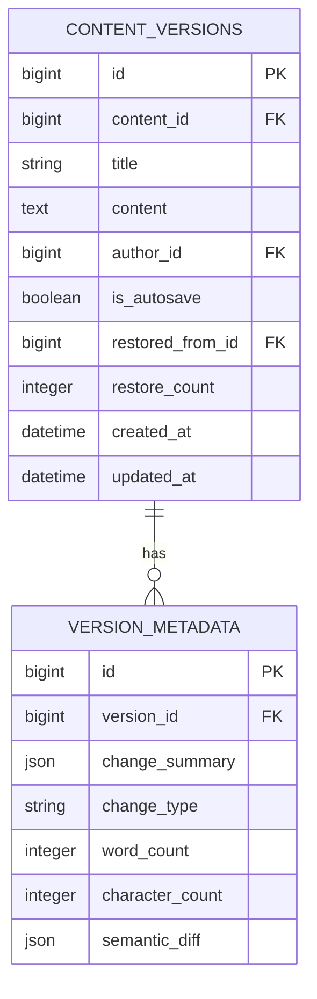

# Content Versioning System Enhancement Plan

## 1. Database Changes

- Add `version_metadata` table for enhanced tracking
- Add `retention_policy` column to `contents` table
- Add indexes for version query performance
- Rename `content_data` field to `content` for consistency (2025-05-02)

## 2. API Endpoints

| Endpoint | Method | Description |
|----------|--------|-------------|
| `/api/contents/{id}/versions/auto` | POST | Configure auto-versioning |
| `/api/contents/{id}/versions/retention` | PUT | Set retention policy |
| `/api/versions/cleanup` | POST | Admin cleanup endpoint |
| `/api/versions/analytics` | GET | Version statistics |

## 3. Frontend Components

1. **Version Settings Panel**
   - Auto-versioning toggle
   - Retention policy configuration
   - Version cleanup controls

2. **Enhanced Version History**
   - Visual diff viewer
   - Change type indicators
   - Bulk actions

3. **Version Analytics Dashboard**
   - Version frequency chart
   - Change type distribution
   - Storage usage

## 4. Testing Strategy

1. **Unit Tests**
   - Version creation triggers
   - Retention policy enforcement
   - Cleanup job logic

2. **Integration Tests**
   - API endpoints
   - Frontend-backend interactions
   - Database operations

3. **Performance Tests**
   - Version creation under load
   - History retrieval with many versions
   - Cleanup job impact

## Future Tasks
- Remove `content_data` field after all systems are migrated (planned for 2025-06-01)

## Implementation Phases

1. **Phase 1: Core Enhancements (2 weeks)**
   - Database changes
   - Auto-versioning triggers
   - Basic retention policies

2. **Phase 2: UI Components (1 week)**
   - Settings panel
   - Enhanced history view

3. **Phase 3: Analytics (1 week)**
   - Dashboard implementation
   - Reporting endpoints