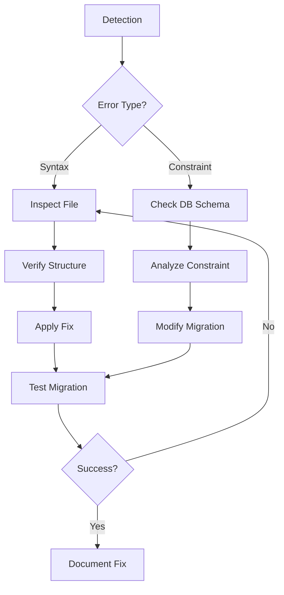

# Migration Syntax Error Resolution Workflow

## Pattern Identified
Recurring PHP syntax errors in migration files due to:
- Duplicate table definitions
- Improper closure of code blocks
- Missing braces/parentheses
- Schema::hasTable pattern violations

## Detection Triggers
1. PHP syntax errors during:
   - `php artisan migrate`
   - `php artisan migrate:status`
   - IDE syntax highlighting
   - Pre-commit hooks

2. Error patterns:
   - "unexpected token"
   - "missing closing brace"
   - "unexpected ')'"

## Resolution Workflow



### Step-by-Step Resolution

1. **Diagnosis**:
   - Locate exact error line from output
   - Verify complete migration structure
   - Check for common anti-patterns:
     - Duplicate column definitions
     - Misplaced closures
     - Missing Schema::hasTable checks

2. **Correction**:
   - Create backup of original file
   - Apply minimal fix to resolve syntax error
   - Ensure idempotent migration pattern:
     ```php
     if (!Schema::hasTable('table')) {
         Schema::create('table', function() {
             // columns
         });
     }
     ```

3. **Validation**:
   - Run isolated migration test:
     ```bash
     php artisan migrate --path=database/migrations/..._create_table.php
     ```
   - Verify table structure matches expectations
   - Check migration status

## Prevention Measures

1. **Pre-Commit Checks**:
   - PHPStan/Larastan static analysis
   - Custom migration validator:
     ```bash
     php artisan validate:migration path/to/migration.php
     ```

2. **Templates**:
   - Standardized migration stub with:
     ```php
     <?php

     use Illuminate\Database\Migrations\Migration;
     use Illuminate\Database\Schema\Blueprint;
     use Illuminate\Support\Facades\Schema;

     return new class extends Migration
     {
         public function up()
         {
             if (!Schema::hasTable('table')) {
                 Schema::create('table', function (Blueprint $table) {
                     $table->id();
                     // Columns
                 });
             }
         }

         public function down()
         {
             Schema::dropIfExists('table');
         }
     };
     ```

3. **Monitoring**:
   - Track similar errors in error logging system
   - Weekly review of migration-related exceptions
   - Auto-tag syntax-related issues

## Escalation Path

1. Junior Dev → Senior Dev → DB Specialist
2. Critical Path Timeline: 30m initial diagnosis → 2h resolution → 4h root cause
3. Documentation Requirements:
   - Error pattern
   - Resolution steps
   - Prevention recommendations

## Retrospective Analysis
- Maintain registry of fixed migrations
- Identify most frequent error types
- Update CI/CD pipeline checks

## Recent Case: Duplicate Analytics Snapshots Table
- **Error**: Multiple migrations attempting to create analytics_snapshots table
- **Resolution**:
  1. Identified original table creation in 2025_04_08 migration
  2. Modified later migrations (2025_04_30_*) with Schema::hasTable checks
  3. Verified both modified migrations run successfully
- **Prevention**:
  - Added validation check in CI pipeline for duplicate table creations
  - Updated migration template to include existence checks by default