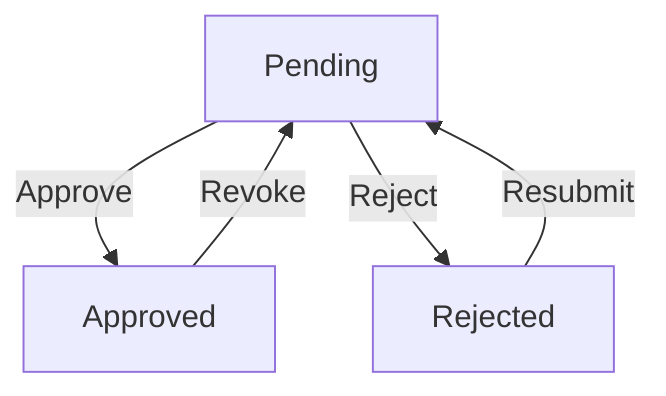

# WorkflowService Architecture Reference

## Database Schema

### Tables
1. `approval_levels`
   - `id` (PK)
   - `workflow_type`
   - `level_number`
   - `approver_role`
   - `tenant_id`

2. `approval_instances`
   - `id` (PK)
   - `workflow_type`
   - `current_state`
   - `tenant_id`
   - `created_at`

3. `workflow_history`
   - `id` (PK)
   - `instance_id` (FK)
   - `from_state`
   - `to_state`
   - `action_by`
   - `timestamp`
   - `tenant_id`

## Core Components

### State Machine

### Tenant Isolation
- All queries include `tenant_id` filter
- Strict mode prevents cross-tenant operations
- Implemented at database trigger level

### Transaction Handling
- State changes wrapped in transactions
- Automatic rollback on failure
- History entries created atomically

## Performance Considerations
- Batch operations limited to 100 items
- Indexes on:
  - `approval_instances.current_state`
  - `workflow_history.instance_id`
  - All `tenant_id` columns