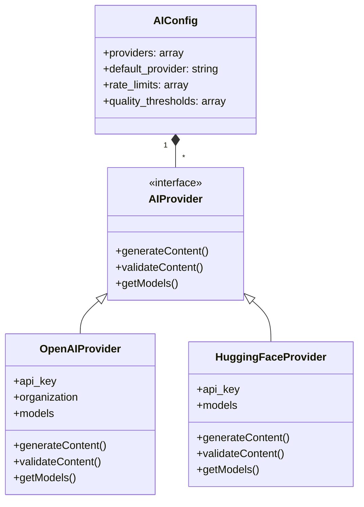
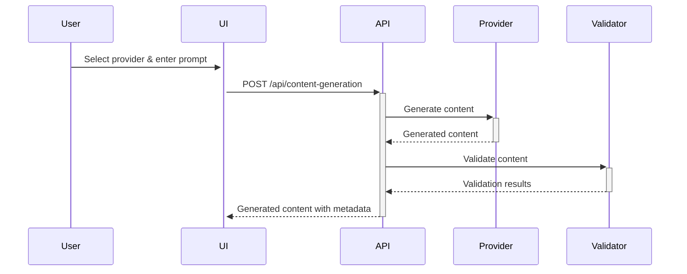

# Multi-Provider AI Architecture Plan

## Overview
This document outlines the architecture for supporting multiple AI providers (OpenAI, Hugging Face, etc.) in the CMS content generation system.

## Configuration Structure

## Implementation Steps

1. **Configuration**:
   - Create `config/ai.php` with provider configurations
   - Support multiple API keys and provider-specific settings
   - Maintain backward compatibility with existing OpenAI config

2. **Core Components**:
   - `AIService` facade to manage provider switching
   - Provider interface (`AIProviderInterface`)
   - Concrete implementations for each provider

3. **Workflow Integration**:

4. **Security Considerations**:
   - Separate API key storage per provider
   - Provider-specific rate limiting
   - Consistent content validation
   - Audit logging

## Backward Compatibility
- Existing OpenAI-only implementations will continue working
- Default provider will be set to OpenAI initially
- Old config keys will be mapped to new structure

## Documentation
- API docs for new endpoints
- Admin panel documentation
- Developer guide for adding new providers