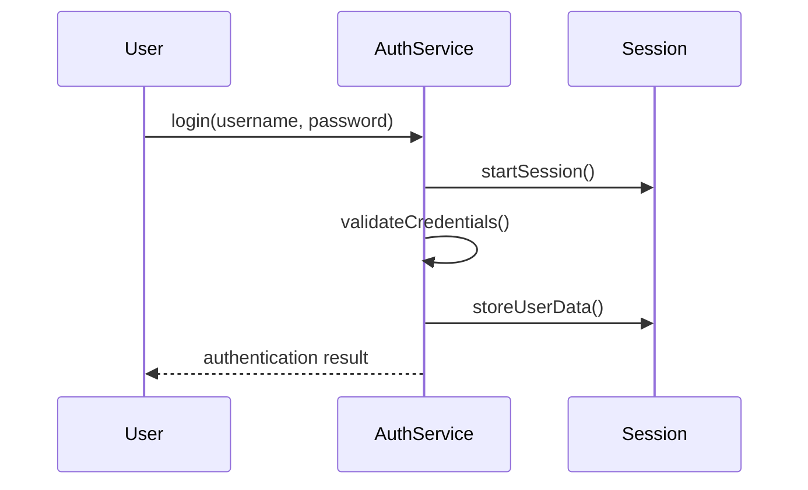

# Authentication System Documentation

## Overview
The authentication system provides secure user authentication and role-based access control for the CMS. It consists of:
- `AuthService`: Core authentication logic
- Session management
- Role-based permissions
- Security headers and protections

## Authentication Flow



## Key Features

### Session Management
- Secure session configuration with strict cookie policies
- Automatic session regeneration
- Session timeout (30 minutes)
- Cross-site scripting protections

### Role-Based Access Control
- Role assignment and inheritance
- Multiple role checking methods:
  - `hasRole()` - Check single role
  - `hasAnyRole()` - Check any of multiple roles
  - `hasAllRoles()` - Check all specified roles
  - `hasRoleWithInheritance()` - Check role with hierarchy

## Security Considerations
- Password hashing using PHP's `password_hash()`
- Session fixation protection
- Secure cookie settings (HttpOnly, Secure, SameSite)
- CSRF protection headers
- Failed login attempt tracking

## Usage Examples

```php
// Initialize AuthService
$auth = Core\AuthService::getInstance();

// Login
if ($auth->login($username, $password)) {
    // Check roles
    if ($auth->hasRole('admin')) {
        // Admin functionality
    }
}

// Logout
$auth->logout();
```

## Integration Guidelines
1. Require `core/AuthService.php`
2. Use singleton pattern via `getInstance()`
3. Check session status before sensitive operations
4. Implement role checks for protected resources