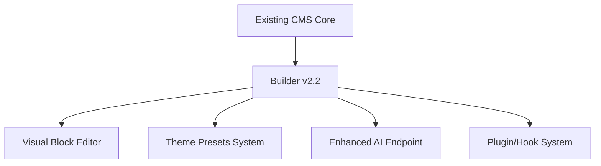

# Builder v2.2 Architectural Changes

## 1. Structural Changes

### Core System Extensions


### File Structure Additions
```
/cms
├── /admin
│   └── /builder          # New builder UI components
├── /includes
│   └── builder-core.php  # New core builder logic
├── /plugins
│   └── /builder-blocks   # Default block library
```

## 2. Backward Compatibility

### Migration Path
- Legacy content auto-converted to blocks on first edit
- Fallback rendering for unconverted content
- Version history maintains original format

### API Compatibility Layer
```php
// Example compatibility wrapper
function renderContent($content) {
    if (is_legacy_format($content)) {
        return convert_to_blocks($content);
    }
    return render_blocks($content);
}
```

## 3. API Modifications

### New Endpoints
| Endpoint | Method | Description |
|----------|--------|-------------|
| `/api/builder/blocks` | GET | List available blocks |
| `/api/builder/ai-suggest` | POST | Get AI suggestions |
| `/api/builder/convert` | POST | Convert legacy content |

### Modified Endpoints
- `/api/content` now accepts block-based structures
- `/api/versions` includes block metadata

## 4. Data Model Extensions

### New Tables
```sql
CREATE TABLE builder_blocks (
    id INT AUTO_INCREMENT PRIMARY KEY,
    name VARCHAR(255) NOT NULL,
    config JSON NOT NULL,
    created_at DATETIME DEFAULT CURRENT_TIMESTAMP
);

CREATE TABLE content_blocks (
    id INT AUTO_INCREMENT PRIMARY KEY,
    content_id INT NOT NULL,
    block_id INT NOT NULL,
    data JSON NOT NULL,
    FOREIGN KEY (content_id) REFERENCES content(id),
    FOREIGN KEY (block_id) REFERENCES builder_blocks(id)
);
```

## 5. Security Implications

### New Considerations
- Block content sanitization
- AI endpoint rate limiting
- Theme preset access controls

### Audit Requirements
1. Validate all block renderers escape output
2. Review AI API key permissions
3. Test tenant isolation for builder features