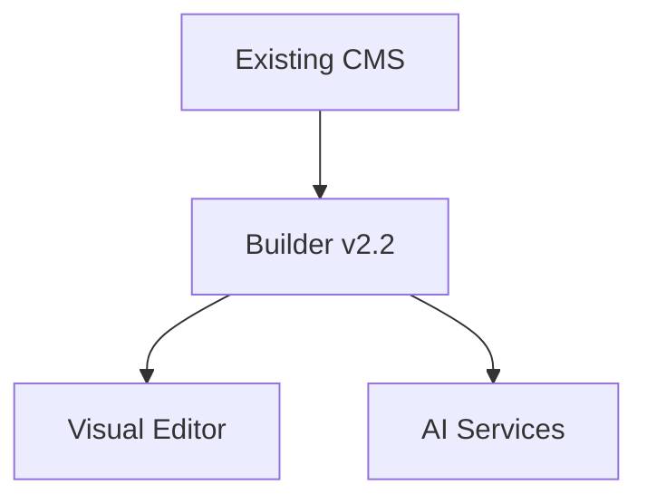

# Builder v2.2 Development Plan

## Executive Summary
Builder v2.2 introduces a block-based content model with visual editing capabilities while maintaining backward compatibility. The project is divided into three phases (MVP, Core, Optional) over 18 weeks with progressive feature rollout. Key innovations include AI-assisted content creation, theme presets system, and plugin extensibility.

[🔗 See Development Phases](#development-phases) | [🔗 Technical Components](#technical-components) | [🔗 Risk Assessment](#risk-assessment)

## Feature Roadmap

### Core Features (Must-Have)
- **Theme Presets System**: JSON-based reusable theme configurations
- **Visual Block Editor**: Drag-and-drop interface with real-time property panel
- **Enhanced AI Endpoint**: Context-aware content/layout suggestions
- **Legacy Conversion**: HTML-to-block migration with preview/diff

### Optional Features
- PDF/AMP export capabilities
- n8n workflow integration
- Scheduled content operations

[🔗 Full feature details](#feature-roadmap-details)

## Technical Components

### Core Modules
| Component | Purpose | Complexity |
|-----------|---------|------------|
| BlockManager.php | Manages block lifecycle | High |
| ThemePresets | Handles theme configurations | Medium |
| AI Service Client | Interfaces with AI APIs | Medium |

### Optional Modules
| Component | Purpose | Complexity |
|-----------|---------|------------|
| PDF Generator | Creates PDF exports | Medium |
| AMP Validator | Ensures AMP compatibility | Low |

[🔗 Complete component list](#technical-components-details)

## Architectural Changes

### Structural Updates


### Database Schema
```sql
CREATE TABLE builder_blocks (
    id INT AUTO_INCREMENT PRIMARY KEY,
    name VARCHAR(255) NOT NULL,
    config JSON NOT NULL
);
```

[🔗 Full architecture specs](#architectural-details)

## Risk Assessment

1. **Content Conversion Risks**
   - Mitigation: Dual rendering engine during transition
   - Fallback: Maintain original content format

2. **Performance Impact**
   - Mitigation: Benchmarking during MVP phase
   - Optimization: Caching layer for block rendering

3. **Security Considerations**
   - Block content sanitization
   - AI endpoint rate limiting
   - Tenant isolation verification

[🔗 Risk mitigation timeline](#risk-mitigation-plan)

## Development Phases

### 1. MVP Phase (6 weeks)
- Core block editor functionality
- Basic block types (text, image)
- Dual rendering engine

### 2. Core Phase (8 weeks)
- Advanced block types
- Theme compatibility layer
- Migration utilities

### 3. Optional Phase (4 weeks)
- AI content suggestions
- Block templates library
- Collaborative editing

[🔗 Phase transition criteria](#phase-transition-details)

## Cross-References

### Feature ↔ Component Mapping
| Feature | Primary Components |
|---------|--------------------|
| Theme Presets | ThemeManager.php, PresetStorageService |
| Visual Editor | BlockManager.php, PropertyPanel.js |

### Architecture ↔ Phase Alignment
| Component | Target Phase |
|-----------|--------------|
| Block Model | MVP |
| AI Integration | Core |
| PDF Export | Optional |

## Appendices

### Feature Roadmap Details
[Content from builder_v2.2_roadmap.md]

### Technical Components Details
[Content from builder_v2.2_components.md]

### Architectural Details
[Content from builder_v2.2_architecture.md]

### Risk Mitigation Plan
[Content from decisionLog.md and builder_v2.2_phases.md]

### Phase Transition Details
[Content from builder_v2.2_phases.md]