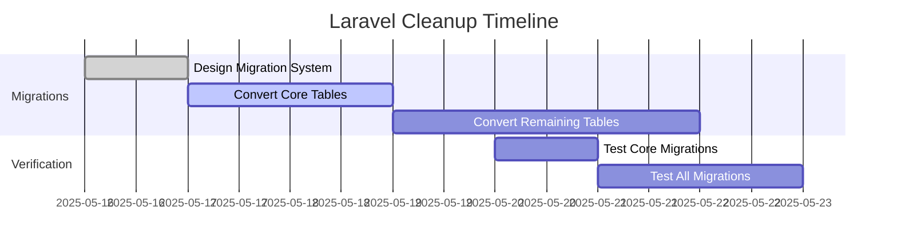

# Laravel Cleanup Plan

## 1. Migration Files Cleanup

### Current State
- Location: `database/migrations/`
- Laravel Patterns:
  - `Schema::create()` and `Schema::dropIfExists()`
  - Laravel schema builder methods (`increments()`, `string()`, `text()`)
  - `timestamps()` method
  - `up()` and `down()` methods structure

### Replacement Strategy
1. **Create Custom Migration System**:
   - New location: `includes/Database/Migrations/`
   - Implement `Migration` base class with:
     ```php
     abstract class Migration {
         abstract public function apply();
         abstract public function revert();
     }
     ```
   - Create `MigrationRunner` to handle execution

2. **Convert Schema Builder**:
   - Replace with direct SQL statements
   - Example conversion:
     ```php
     // Laravel
     Schema::create('contents', function($table) {
         $table->increments('id');
         $table->string('title');
     });
     
     // Replacement
     $sql = "CREATE TABLE contents (
         id INT AUTO_INCREMENT PRIMARY KEY,
         title VARCHAR(255) NOT NULL
     )";
     ```

3. **Priority Order**:
   - 1. Create migration system infrastructure
   - 2. Convert high-priority tables (contents, users)
   - 3. Convert remaining tables

4. **Impact Assessment**:
   - ✅ Removes Laravel dependency
   - ✅ Better aligns with project constraints
   - ⚠️ Requires testing of all migrations
   - ⚠️ Need to maintain backward compatibility

5. **Testing Requirements**:
   - Verify each migration applies correctly
   - Test rollback functionality
   - Check data integrity after migration

## 2. Mail System (Already Refactored)

- Current state: Already moved to `includes/mail/`
- No action needed
- Verification:
  - Confirm all email templates render correctly
  - Test email delivery

## 3. Blade Templates

- Status: Already removed
- Verification:
  - Check all email templates use new rendering system
  - Confirm no `.blade.php` files remain

## 4. Remaining Patterns Check

1. **Search for Laravel Helpers**:
   - `array_*` helpers
   - `str_*` helpers
   - `route()` helper

2. **Search for Facades**:
   - `DB::`
   - `Cache::`
   - `Log::`

3. **Replacement Strategy**:
   - Use native PHP functions
   - Implement custom utility classes

## Implementation Plan



## Risk Mitigation
1. Create database backups before each migration change
2. Implement rollback scripts for each change
3. Test in staging environment first
## Database Privilege Cleanup Needed
- Remove ALL PRIVILEGES on `laravel`.* from `cms_user`@`localhost`
- Command: `REVOKE ALL PRIVILEGES ON laravel.* FROM 'cms_user'@'localhost'; FLUSH PRIVILEGES;`