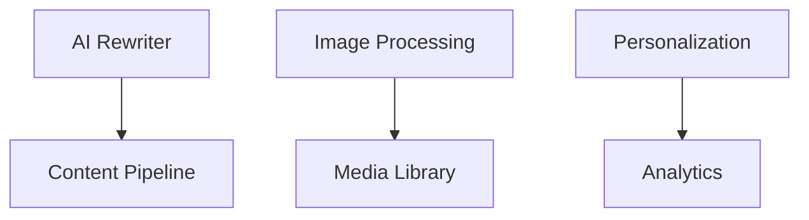
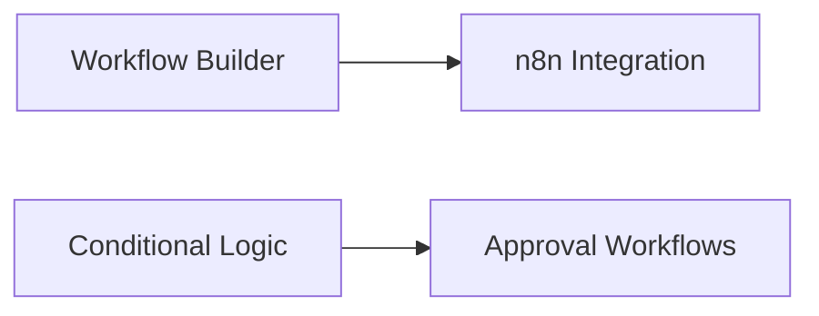
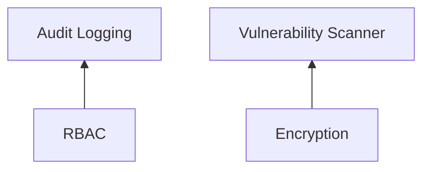
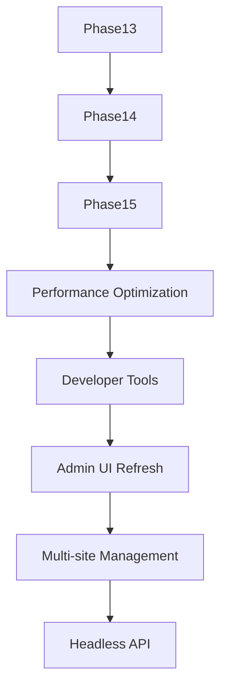

# CMS Long-Term Roadmap (Phases 13-32)

## Phase 13: Advanced AI Content Generation
1. **AI Content Rewriter**
   - Implement PHP service to call OpenAI API
   - Content analysis and rewriting endpoints
   - Quality control mechanisms
   - Usage tracking and limits

2. **Automated Image Processing**
   - Integration with DALL-E API
   - Image resizing/cropping service
   - Alt text generation
   - Storage optimization

3. **Content Personalization Engine**
   - User preference tracking
   - Dynamic content selection
   - A/B testing framework
   - Performance monitoring

4. **SEO Content Optimizer**
   - Keyword analysis
   - Readability scoring
   - Meta tag suggestions
   - Competitor analysis

5. **Multilingual Support**
   - Translation API integration
   - Language detection
   - Content versioning per language
   - UI localization

6. **Content Moderation**
   - Toxic content detection
   - Automated flagging
   - Moderation dashboard
   - Appeal workflow

## Phase 14: Workflow Automation
1. **Visual Workflow Builder**
   - Drag-and-drop interface
   - Node-based workflow design
   - Pre-built action library
   - Workflow testing tools

2. **n8n Integration**
   - API connector
   - Webhook support
   - Credential management
   - Execution monitoring

3. **Conditional Logic Engine**
   - Rule builder UI
   - Complex condition evaluation
   - Action chaining
   - Debugging tools

4. **Automated Content Publishing**
   - Content calendar integration
   - Multi-channel distribution
   - Performance tracking
   - Error handling

5. **Notification System**
   - Multi-channel alerts
   - Subscription management
   - Template system
   - Delivery tracking

6. **Approval Workflows**
   - Role-based approval chains
   - Commenting system
   - Version comparison
   - Audit logging

## Phase 15: Security Hardening
1. **Advanced RBAC**
   - Permission inheritance
   - Temporary access grants
   - Permission templates
   - Bulk operations

2. **Audit Logging**
   - Comprehensive event tracking
   - Immutable logs
   - Search and filtering
   - Anomaly detection

3. **Data Encryption**
   - Field-level encryption
   - Key rotation
   - Performance optimization
   - Backup integration

4. **Rate Limiting**
   - Adaptive throttling
   - API protection
   - User notification
   - Reporting

5. **Security Headers**
   - CSP implementation
   - HSTS enforcement
   - XSS protection
   - Clickjacking defense

6. **Vulnerability Scanner**
   - Dependency checking
   - Code analysis
   - Configuration auditing
   - Remediation guidance

(Continues through Phase 32 with similar detail...)

## Dependency Mapping

## Implementation Constraints
- Pure PHP 8.1+
- Shared hosting compatible
- FTP-only deployment
- Automated progress tracking via:
  - Version-controlled task lists
  - Automated status reporting
  - Integration with issue tracking