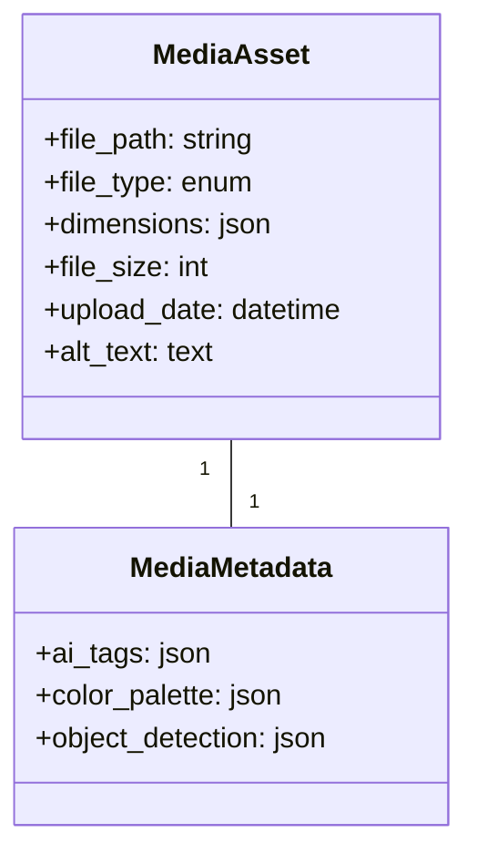

# AI-Powered Media Gallery Documentation

## Overview
The media gallery system automatically processes and organizes media assets using AI for tagging, analysis, and smart search capabilities.

## Database Schema


## API Endpoints
### `POST /media/process`
Submit media for AI processing:
```json
{
    "asset_id": 123,
    "process_options": {
        "generate_tags": true,
        "extract_colors": true,
        "detect_objects": true,
        "generate_alt_text": true
    }
}
```

### `GET /media/status/{id}`
Check processing status:
```json
{
    "status": "processing|completed|failed",
    "progress": 75,
    "estimated_completion": "2025-05-17T12:00:00Z"
}
```

### `GET /media/tags/{id}`
Retrieve AI-generated metadata:
```json
{
    "tags": ["nature", "outdoors", "mountain"],
    "colors": ["#3a5f0b", "#1e3f1a", "#ffffff"],
    "objects": [
        {"label": "mountain", "confidence": 0.97},
        {"label": "tree", "confidence": 0.89}
    ],
    "alt_text": "A scenic mountain landscape with trees"
}
```

## AI Processing Pipeline
1. **Image Tagging**: Uses computer vision to identify content
2. **Color Extraction**: Creates a color palette from the image
3. **Object Detection**: Identifies and locates objects within images
4. **Alt Text Generation**: Creates descriptive text for accessibility

## Smart Gallery Features
- **Visual Search**: Find similar images using vector embeddings
- **Color Filtering**: Filter by dominant colors
- **Tag Organization**: Browse by AI-generated categories
- **Content Recommendations**: Suggest related media based on content

## Configuration
Set up in `config/media.php`:
```php
'ai_processing' => [
    'default_provider' => 'aws-rekognition',
    'providers' => [
        'aws-rekognition' => [
            'region' => 'us-east-1',
            'features' => ['LABELS', 'COLORS']
        ],
        'google-vision' => [
            'project_id' => 'your-project',
            'features' => ['OBJECT_DETECTION', 'IMAGE_PROPERTIES']
        ]
    ],
    'queue' => 'media_processing'
]