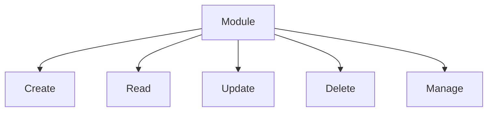

# Permissions System Architecture

## Current Implementation
- **Roles**: admin, editor, viewer (defined in `roles.php`)
- **Permissions**: 6 core permissions (defined in `permissions.php`)
- **Assignment**: Through `PermissionManager` (database-backed)
- **Audit**: Logging via `AuditLogger`

## Proposed Improvements

### 1. Granular Permissions


### 2. Dynamic Permission Management
- Admin UI for permission assignment
- Role cloning functionality
- Bulk permission operations

### 3. Middleware Integration
```php
// Example middleware
if (!PermissionMiddleware::check('content.edit')) {
    throw new ForbiddenException();
}
```

### 4. Enhanced Audit Logging
- Track permission changes
- Record context (IP, user agent)
- Exportable logs

### 5. Verification System
- Runtime permission checks
- Cached verification results
- UI element visibility control

## Implementation Roadmap
1. Extend permission definitions
2. Build admin UI components
3. Implement middleware
4. Enhance audit logging
5. Add verification system

## Integration Points
- User management module
- Content management system
- Admin dashboard
- API endpoints