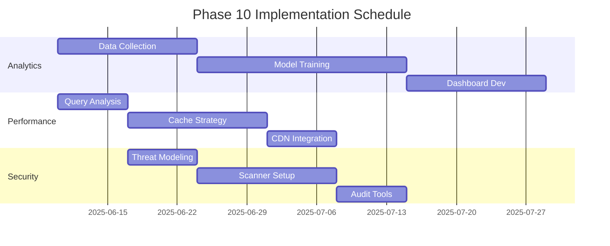
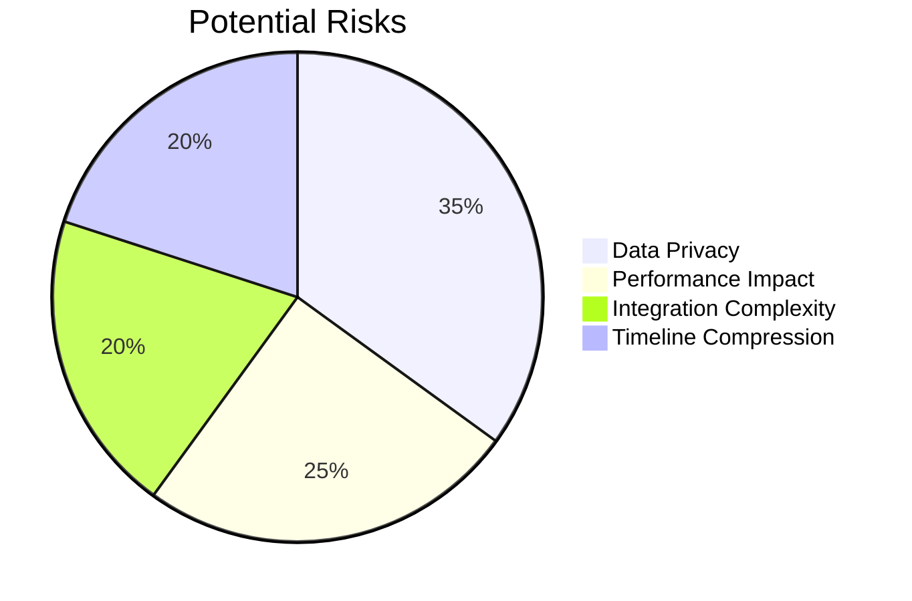

# Phase 10 Transition Plan

## Key Objectives
1. **Analytics Integration**
   - Implement real-time content performance tracking
   - Develop predictive analytics models
   - Create visualization dashboards

2. **Performance Optimization**
   - Database query optimization
   - Caching strategy implementation
   - Content delivery network integration

3. **Security Enhancements**
   - Advanced threat detection
   - Automated vulnerability scanning
   - Compliance auditing tools

## Implementation Timeline

## Resource Requirements
| Category | Resources |
|----------|-----------|
| Development | 3 backend engineers, 2 frontend engineers |
| Analytics | 1 data scientist, 1 BI specialist |
| Infrastructure | 1 DevOps engineer |
| Testing | 2 QA engineers |

## Risk Assessment

## Key Dependencies
1. Completion of Phase 9 federation features
2. Availability of analytics team
3. CDN provider contract finalization
4. Security audit completion

## Success Metrics
1. 95% reduction in high-severity vulnerabilities
2. 50% improvement in content delivery speed
3. 80% accuracy in predictive content recommendations
4. 99.9% uptime during peak loads