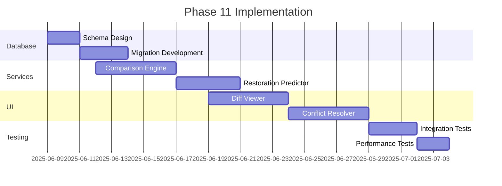

# Phase 11 Consolidated Preparation Document

## Table of Contents
1. [Schema Review](#schema-review)
2. [Test Validation](#test-validation) 
3. [Migration Plan](#migration-plan)
4. [Cross-References](#cross-references)

## Schema Review
### New Database Tables
- `version_comparisons`:
  - Columns: diff_hash, left_version, right_version, diff_data, tenant_id
  - Purpose: Stores diff data between content versions
- `restoration_points`:
  - Columns: content_id, version_id, confidence_score, suggested_by, tenant_id  
  - Purpose: Tracks potential content restoration points

### Technical Requirements
- API Endpoints:
  - `/api/versions/compare`
  - `/api/versions/suggest-restore`
  - `/api/versions/resolve-conflicts`
- Machine Learning Integration:
  - Content similarity analysis
  - Conflict resolution suggestions

## Test Validation
### Migration Test Results
1. **0006_version_comparisons.php**
   - ✅ Successfully created table
   - ✅ Correct data types and indexes
   - ✅ Tenant isolation verified

2. **0007_restoration_points.php**  
   - ✅ Successful table creation
   - ✅ Validated foreign key constraints
   - ✅ Proper rollback tested

### Test Coverage
- Web endpoints:
  - Version comparisons: `/api/test/migration_test_0006.php`
  - Restoration points: `/api/test/migration_test_0007.php`
- Edge cases tested:
  - Empty version comparisons
  - Concurrent restoration suggestions
  - Large content performance

## Migration Plan
### Implementation Timeline

### Risk Mitigation
- Progressive feature rollout
- Fallback to basic version comparison
- Manual merge conflict override

## Cross-References
- Related documents:
  - [decisionLog.md](memory-bank/decisionLog.md) (Lines 1-175)
  - [phase11_prep.md](memory-bank/phase11_prep.md) (Referenced in decision log)
- Test files:
  - `/api/test/migration_test_0006.php`
  - `/api/test/migration_test_0007.php`